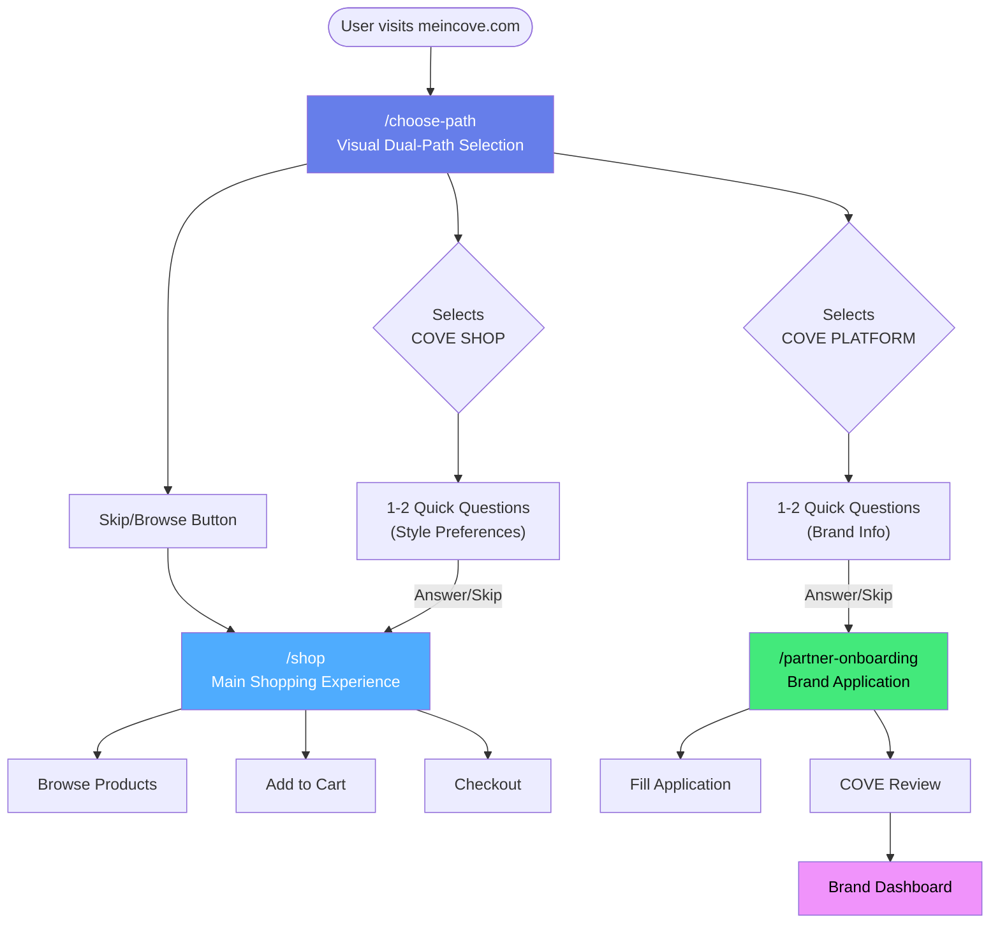

# Phase 1: Complete Onboarding Path - APPROVED ✅

## Final Naming Convention

| Experience | Primary Name | Subtitle | Purpose |
|------------|-------------|----------|---------|
| **Shopping** | **COVE SHOP** | Browse & Buy Premium Products | For customers/shoppers |
| **Selling** | **COVE PLATFORM** | Sell Your Products | For brands/partners |
| **AI Assistant** | **COVE CONCIERGE** | Your Personal Shopping Assistant | AI chatbot |

---

## Complete User Flow



---

## Page-by-Page Breakdown

### **1. Root Domain (meincove.com)**

**Behavior:**
- First-time visitors → Redirect to `/choose-path`
- Returning users with preference → Redirect to last selected path
- Deep links (from SEO/ads) → Go directly to destination

**Implementation:**
```typescript
// app/page.tsx
export default function RootPage() {
  // Check localStorage for user preference
  // If first visit → redirect to /choose-path
  // If returning → redirect to /shop or /partner-onboarding
}
```

---

### **2. Choose Path Page (/choose-path)**

**Purpose:** Visual selection between COVE SHOP and COVE PLATFORM

**Layout:**
```
┌─────────────────────────────────────────────────────────────┐
│                  Choose Your Experience                      │
│                                                              │
├──────────────────────────┬───────────────────────────────────┤
│                          │                                   │
│      COVE SHOP          │      COVE PLATFORM                │
│  Browse & Buy Premium   │   Sell Your Products              │
│      Products           │                                   │
│                          │                                   │
│  [Product Visual/Grid]  │  [Dashboard Visual]               │
│                          │                                   │
│  ✓ AI-Powered Search    │  ✓ Reach Premium Shoppers         │
│  ✓ Curated Collections  │  ✓ Easy Product Management        │
│  ✓ Secure Checkout      │  ✓ Analytics & Insights           │
│  ✓ Fast Shipping        │  ✓ Marketing Support              │
│                          │                                   │
│  [Start Shopping →]     │  [Apply to Sell →]                │
│                          │                                   │
└──────────────────────────┴───────────────────────────────────┘
│                                                              │
│              [Just Browsing? Skip to Shop →]                │
└─────────────────────────────────────────────────────────────┘
```

**Interactions:**
- **Desktop:** Hover to expand column, show more details
- **Mobile:** Tap to select, tap again to confirm
- **Skip Button:** Goes directly to `/shop` as guest

**Features:**
- Smooth animations
- High-quality visuals
- Clear value propositions
- No forced choice (skip option)

---

### **3A. COVE SHOP Questions (After selecting Shop)**

**Purpose:** Quick personalization for shopping experience

**Question 1:**
```
What's your style?
(Select all that apply)

□ Casual Everyday
□ Bold & Original  
□ Limited Edition
□ Designer Streetwear
□ Just Exploring

[Skip Questions →]
```

**Question 2 (Optional):**
```
What are you shopping for today?

□ Tops & Tees
□ Bottoms
□ Footwear
□ Accessories
□ Everything

[Skip →]
```

**Duration:** 5-10 seconds max  
**Skippable:** Yes, at any point  
**Storage:** localStorage for personalization

---

### **3B. COVE PLATFORM Questions (After selecting Platform)**

**Purpose:** Pre-qualify brand and customize onboarding

**Question 1:**
```
Tell us about your brand

○ Established Brand (1000+ products)
○ Growing Brand (100-1000 products)
○ New Brand (launching soon)
○ Just Exploring

[Skip Questions →]
```

**Question 2:**
```
What do you sell?

□ Apparel
□ Footwear
□ Accessories
□ Multiple Categories

[Skip →]
```

**Duration:** 5-10 seconds max  
**Skippable:** Yes, at any point  
**Storage:** Pre-fill application form

---

### **4A. COVE SHOP Page (/shop)**

**Purpose:** Main shopping experience (current `/catalog` renamed)

**Personalization Based on Answers:**
- Selected "Casual" → Show casual tier first
- Selected "Designer" → Show designer tier first
- Skipped questions → Show all tiers equally

**Features:**
- Product grid with filters
- AI-powered search
- Collections
- Cart integration
- Cove Concierge AI button

**URL:** `https://meincove.com/shop`

---

### **4B. COVE PLATFORM Page (/partner-onboarding)**

**Purpose:** Brand application and onboarding

**Pre-filled Based on Answers:**
- Brand size → Auto-select in form
- Category → Pre-check categories

**Sections:**
1. Brand Information
2. Product Details
3. Business Information
4. Terms & Agreement

**URL:** `https://meincove.com/partner-onboarding`

---

## Routing Structure

```
src/app/
├── page.tsx                        # Root → redirects to /choose-path
├── choose-path/                    # NEW
│   └── page.tsx                    # Dual-path visual selection
├── shop/                           # RENAMED from /catalog
│   └── page.tsx                    # Main shopping experience
├── partner-onboarding/             # NEW
│   ├── page.tsx                    # Application form
│   ├── application/
│   │   └── page.tsx                # Multi-step form
│   └── status/
│       └── page.tsx                # Application status check
└── components/
    └── onboarding/                 # NEW
        ├── ChoosePathCard.tsx      # Path selection cards
        ├── QuestionFlow.tsx        # Question component
        └── PersonalizationModal.tsx # Optional modal variant
```

---

## State Management

### **User Preference Schema**

```typescript
interface UserPreference {
  selectedPath: 'shop' | 'platform' | null;
  shopPreferences?: {
    styles: string[];
    categories: string[];
  };
  platformPreferences?: {
    brandSize: 'established' | 'growing' | 'new';
    categories: string[];
  };
  timestamp: number;
  skipped: boolean;
}

// Stored in localStorage as 'cove_user_preference'
```

### **Session Flow**

```typescript
// First visit
localStorage.getItem('cove_user_preference') === null
→ Redirect to /choose-path

// Returning user
localStorage.getItem('cove_user_preference') !== null
→ Redirect to last selected path (/shop or /partner-onboarding)

// Deep link
User clicks link to /shop directly
→ Skip choose-path, go straight to shop
→ Save preference for future visits
```

---

## SEO Strategy

### **URL Structure**

| URL | Purpose | SEO Target |
|-----|---------|------------|
| `meincove.com` | Root redirect | Brand searches |
| `meincove.com/choose-path` | Path selection | "Cove Shop", "Cove Platform" |
| `meincove.com/shop` | Shopping | Product keywords, "premium streetwear" |
| `meincove.com/partner-onboarding` | Brand onboarding | "sell products online", "brand platform" |

### **Meta Tags**

```html
<!-- /choose-path -->
<title>MeinCove - Premium Shopping & Brand Platform</title>
<meta name="description" content="Choose your experience: Shop premium products or grow your brand with Cove.">

<!-- /shop (Cove Shop) -->
<title>Cove Shop - Premium Streetwear & Fashion</title>
<meta name="description" content="Discover curated premium products with AI-powered search and personalized recommendations.">

<!-- /partner-onboarding (Cove Platform) -->
<title>Cove Platform - Sell Your Products, Grow Your Brand</title>
<meta name="description" content="Join premium brands selling on Cove. Easy onboarding, powerful tools, reach engaged shoppers.">
```

### **Deep Linking for SEO**

```
Google Search: "premium sneakers"
→ Lands on: /shop?category=footwear (bypass choose-path)

Google Search: "sell fashion online"
→ Lands on: /partner-onboarding (bypass choose-path)

Google Search: "meincove" or "cove shop"
→ Lands on: /choose-path (brand search)
```

---

## Analytics & Tracking

### **Events to Track**

**Choose Path Page:**
- `choose_path_viewed`
- `shop_selected`
- `platform_selected`
- `skip_clicked`
- `time_to_selection`

**Questions:**
- `question_answered`
- `question_skipped`
- `all_questions_skipped`
- `personalization_data_collected`

**Conversions:**
- `shop_first_product_view`
- `shop_add_to_cart`
- `platform_application_started`
- `platform_application_submitted`

---

## Mobile Optimization

### **Choose Path Page (Mobile)**

```
┌─────────────────────┐
│  Choose Experience  │
├─────────────────────┤
│                     │
│    COVE SHOP       │
│  Browse & Buy      │
│                     │
│  [Visual]          │
│                     │
│  ✓ AI Search       │
│  ✓ Collections     │
│                     │
│  [Start Shopping]  │
│                     │
├─────────────────────┤
│                     │
│  COVE PLATFORM     │
│  Sell Products     │
│                     │
│  [Visual]          │
│                     │
│  ✓ Reach Shoppers  │
│  ✓ Easy Tools      │
│                     │
│  [Apply to Sell]   │
│                     │
├─────────────────────┤
│ [Just Browsing →]  │
└─────────────────────┘
```

**Interactions:**
- Vertical scroll
- Tap to expand card
- Tap button to proceed
- Swipe gestures (optional)

---

## Implementation Phases

### **Phase 1.1: Foundation (Week 1)**
- [ ] Create `/choose-path` page with static layout
- [ ] Build path selection cards (COVE SHOP, COVE PLATFORM)
- [ ] Implement routing logic
- [ ] Add skip functionality
- [ ] Mobile responsive design

### **Phase 1.2: Questions (Week 2)**
- [ ] Build question flow component
- [ ] Implement COVE SHOP questions
- [ ] Implement COVE PLATFORM questions
- [ ] Add skip at each step
- [ ] Store preferences in localStorage

### **Phase 1.3: Integration (Week 3)**
- [ ] Rename `/catalog` to `/shop`
- [ ] Implement personalization in `/shop`
- [ ] Build `/partner-onboarding` page
- [ ] Pre-fill form from preferences
- [ ] Connect all flows end-to-end

### **Phase 1.4: Polish (Week 4)**
- [ ] Add animations and transitions
- [ ] Optimize mobile experience
- [ ] Implement analytics tracking
- [ ] SEO optimization (meta tags, deep linking)
- [ ] A/B testing setup
- [ ] User testing and refinement

---

## Success Metrics

### **Primary KPIs**
- **Path Selection Rate:** % of users who select a path vs skip
- **Question Completion Rate:** % who answer vs skip questions
- **Conversion Rate:** % who complete desired action (shop/apply)
- **Time to First Action:** Seconds from landing to first meaningful action

### **Targets**
- Path selection rate: > 70%
- Question completion: > 50%
- Conversion rate: +20% vs current baseline
- Time to first action: < 30 seconds

---

## Next Steps

1. ✅ **Create feature branch:** `feature/cove-onboarding`
2. ✅ **Start with Phase 1.1:** Build `/choose-path` page
3. ✅ **Iterate based on feedback**
4. ✅ **Deploy to staging for testing**
5. ✅ **Soft launch with A/B test**

---

## Approved By

**User:** Adarsh  
**Date:** 2025-12-07  
**Status:** ✅ APPROVED - Ready for Implementation

---

## Notes

- Keep questions minimal (1-2 max per path)
- Skip option must be prominent
- Mobile-first design approach
- Deep linking is critical for SEO
- A/B test against simpler flow
- Monitor bounce rates closely
