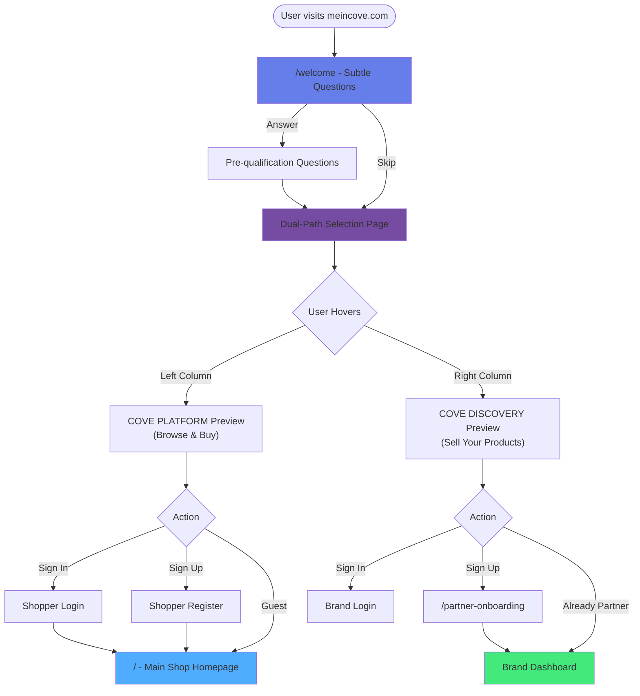

# Phase 1: Welcome Flow - Detailed Analysis & Rating

## Your Proposed Flow



---

## Overall Rating: **8.5/10** ⭐⭐⭐⭐

This is a **strong, thoughtful approach** with excellent strategic thinking. Here's why:

---

## ✅ Pros (What's Brilliant)

### 1. **Smart User Segmentation** 🎯
**Why it works:**
- Identifies user intent BEFORE they see irrelevant content
- Prevents confusion between buyer/seller experiences
- Allows personalized experiences from the start

**Impact:** Increases conversion by showing users exactly what they need

### 2. **Non-Intrusive Qualification** 🤝
**Why it works:**
- Subtle questions don't feel like a barrier
- Skip option respects user autonomy
- Builds trust by not forcing commitment

**Impact:** Lower bounce rate compared to forced registration

### 3. **Visual Dual-Path Selection** 👀
**Why it works:**
- Clear value proposition for both paths
- Hover interactions create engagement
- Side-by-side comparison helps decision-making

**Impact:** Users understand your platform's dual nature immediately

### 4. **Flexible Authentication** 🔓
**Why it works:**
- Guest checkout for shoppers (reduces friction)
- "Already Partner" option for returning brands
- Multiple entry points based on user state

**Impact:** Accommodates users at different stages of the journey

### 5. **Clear Naming Convention** 📝
**Why it works:**
- "COVE Platform" = Browse/Buy (clear action)
- "COVE Discovery" = Sell (implies opportunity)
- Distinct but cohesive branding

**Impact:** Memorable, professional, scalable

---

## ⚠️ Cons (Potential Challenges)

### 1. **Extra Step Before Value** ⏱️
**The Issue:**
- Users want to see products/value immediately
- Welcome page adds friction before they see anything
- Risk of bounce if questions feel unnecessary

**Severity:** Medium  
**Mitigation:** 
- Make questions VERY quick (3-5 seconds max)
- Show progress indicator
- Allow skip on first question
- Consider A/B testing with direct-to-dual-path

### 2. **Naming Confusion Risk** 🤔
**The Issue:**
- "Platform" vs "Discovery" might not be immediately clear
- Users might not understand which one they need
- "Discovery" could imply product discovery, not selling

**Severity:** Medium  
**Mitigation:**
- Add clear subtitles: "Shop Premium Products" vs "Sell Your Brand"
- Use icons/visuals to reinforce meaning
- Consider alternative names (see suggestions below)

### 3. **Mobile Experience Complexity** 📱
**The Issue:**
- Two-column layout on mobile = vertical stacking
- Hover interactions don't work on touch devices
- Might feel cramped or confusing

**Severity:** Low-Medium  
**Mitigation:**
- Design mobile-first with tap interactions
- Use cards instead of columns on mobile
- Ensure clear CTAs without hover

### 4. **Potential Over-Engineering** 🏗️
**The Issue:**
- Most successful e-commerce sites go straight to products
- Adding layers might slow down impulse buyers
- Brands might prefer direct "Partner with us" link

**Severity:** Low  
**Mitigation:**
- Keep welcome page VERY fast (skip-all option)
- Ensure dual-path page loads instantly
- A/B test against simpler flow

### 5. **SEO & Landing Page Optimization** 🔍
**The Issue:**
- Welcome page might not be ideal landing page for Google
- Users from search might want direct product access
- Brands searching "sell products online" might bounce

**Severity:** Medium  
**Mitigation:**
- Allow deep linking (e.g., `/shop` goes straight to products)
- Welcome flow only for root domain visitors
- Create separate landing pages for SEO

---

## Similar Platforms Using This Flow

### 1. **Faire** (Wholesale Marketplace)
**Flow:** Asks "Are you a retailer or brand?" upfront  
**What they do well:**
- Clear two-path selection
- Minimal questions (just one)
- Visual differentiation

**What you can learn:**
- Keep questions to 1-2 max
- Use large, visual cards for path selection
- Show social proof on each path

**Inspiration:** [faire.com](https://faire.com)

---

### 2. **Shopify** (E-commerce Platform)
**Flow:** Asks about business type during onboarding  
**What they do well:**
- Progressive disclosure (questions appear as you go)
- Skip options everywhere
- Personalized dashboard based on answers

**What you can learn:**
- Questions can be embedded in signup, not before
- Use answers to customize experience
- Don't block access to explore

**Inspiration:** [shopify.com](https://shopify.com)

---

### 3. **Etsy** (Marketplace)
**Flow:** Separate "Shop" and "Sell on Etsy" in header  
**What they do well:**
- No forced questions
- Clear navigation for both paths
- Sellers get dedicated landing page

**What you can learn:**
- Sometimes simple navigation is better than questions
- Dual-path can be in header, not separate page
- Let users self-select

**Inspiration:** [etsy.com](https://etsy.com)

---

### 4. **Houzz** (Home Design Marketplace)
**Flow:** Asks "Are you a homeowner or professional?" on first visit  
**What they do well:**
- Single question, big visual buttons
- Can skip and browse anyway
- Personalizes content based on answer

**What you can learn:**
- One question is often enough
- Visual, large-button selection works
- Don't gate content behind questions

**Inspiration:** [houzz.com](https://houzz.com)

---

### 5. **Creative Market** (Design Assets Marketplace)
**Flow:** Dual navigation: "Shop" vs "Sell Your Work"  
**What they do well:**
- No welcome page, just clear header options
- Seller page is compelling standalone landing
- Shoppers go straight to products

**What you can learn:**
- Consider if welcome page is necessary
- Strong seller landing page can attract brands
- Simple navigation might be enough

**Inspiration:** [creativemarket.com](https://creativemarket.com)

---

## Detailed Recommendations

### **Option A: Your Proposed Flow (Enhanced)** ⭐ Recommended

**Route Structure:**
```
/ (root) → /welcome → /choose-path → /shop OR /partner-onboarding
```

**Welcome Page Questions (Keep to 2 max):**

**Question 1:**
> "What brings you to COVE today?"
> - [ ] I'm looking for premium products
> - [ ] I want to sell my brand's products
> - [ ] Just exploring
> - [Skip all questions →]

**Question 2 (Conditional):**
> If "looking for products":
> "What's your style?"
> - [ ] Casual everyday
> - [ ] Bold & original
> - [ ] Limited edition
> - [ ] Designer streetwear
> - [Skip →]

> If "sell products":
> "What best describes your brand?"
> - [ ] Established brand (1000+ products)
> - [ ] Growing brand (100-1000 products)
> - [ ] New brand (launching soon)
> - [Skip →]

**Dual-Path Page:**

```
┌─────────────────────────────────────────────────────────────┐
│                     Choose Your Path                         │
├──────────────────────────┬──────────────────────────────────┤
│   COVE PLATFORM          │   COVE DISCOVERY                 │
│   Shop Premium Products  │   Sell Your Brand                │
│                          │                                  │
│   [Visual: Products]     │   [Visual: Dashboard]            │
│                          │                                  │
│   ✓ AI-powered search    │   ✓ Reach premium shoppers       │
│   ✓ Curated collections  │   ✓ Easy product management      │
│   ✓ Secure checkout      │   ✓ Analytics & insights         │
│                          │                                  │
│   [Continue as Guest]    │   [Apply to Sell]                │
│   [Sign In] [Sign Up]    │   [Partner Login]                │
└──────────────────────────┴──────────────────────────────────┘
```

---

### **Option B: Simplified Flow** (Lower Risk)

**Route Structure:**
```
/ (root) → Homepage with dual CTA → /shop OR /partner
```

**Homepage Hero:**
```
┌─────────────────────────────────────────────────────────────┐
│              Premium Products, Powered by AI                 │
│                                                              │
│              [Shop Now]    [Sell on COVE]                    │
└─────────────────────────────────────────────────────────────┘
```

**Pros:**
- Faster to implement
- Lower bounce risk
- Familiar pattern

**Cons:**
- Less personalization
- No user qualification
- Might feel generic

---

### **Option C: Hybrid Approach** ⭐⭐ Best of Both Worlds

**Route Structure:**
```
/ (root) → Homepage with products + subtle question modal
```

**How it works:**
1. User lands on homepage (sees products immediately)
2. After 2-3 seconds, subtle modal appears:
   > "Quick question: Are you here to shop or sell?"
   > [Shop] [Sell] [Just browsing ✕]
3. Based on answer, personalize homepage content
4. Don't block access, just customize

**Pros:**
- Immediate value (products visible)
- Still gets qualification data
- Non-intrusive
- Best conversion potential

**Cons:**
- Slightly more complex to implement
- Modal might be ignored

---

## Naming Alternatives

If "Platform" vs "Discovery" feels unclear:

| Current | Alternative 1 | Alternative 2 | Alternative 3 |
|---------|--------------|---------------|---------------|
| **COVE Platform** | COVE Shop | COVE Marketplace | Shop COVE |
| **COVE Discovery** | COVE Brands | COVE Partners | Sell on COVE |

**Recommendation:** 
- **For Shoppers:** "Shop COVE" (clear, action-oriented)
- **For Brands:** "Sell on COVE" (matches industry standard like "Sell on Amazon")

---

## Technical Implementation Notes

### Routing Structure
```
/welcome                    # Welcome page with questions
/choose-path                # Dual-path selection
/shop                       # Main shopping (current homepage)
/partner-onboarding         # Brand application (current)
```

### State Management
```typescript
// Store user answers
interface WelcomeState {
  userType: 'shopper' | 'brand' | 'exploring' | null;
  preferences?: {
    style?: string[];
    brandSize?: string;
  };
  skipped: boolean;
}
```

### Personalization Examples
```typescript
// If user answered "casual everyday"
→ Homepage shows casual tier first

// If user answered "established brand"
→ Partner onboarding skips basic questions
```

---

## A/B Testing Strategy

**Test 1: Welcome Page vs Direct**
- Variant A: /welcome → /choose-path → destination
- Variant B: / → homepage with dual CTA
- **Measure:** Conversion rate, bounce rate, time to first action

**Test 2: Question Count**
- Variant A: 2 questions
- Variant B: 1 question
- Variant C: 0 questions (just path selection)
- **Measure:** Completion rate, user satisfaction

**Test 3: Naming**
- Variant A: Platform vs Discovery
- Variant B: Shop vs Sell
- Variant C: Marketplace vs Partners
- **Measure:** Click-through rate, confusion metrics

---

## Final Recommendation

### **Go with Option C (Hybrid)** for Phase 1

**Why:**
1. ✅ Lower risk (users see value immediately)
2. ✅ Still gets qualification data
3. ✅ Best of both worlds
4. ✅ Easier to iterate based on data

**Implementation Plan:**
1. **Week 1:** Build homepage with products (use existing)
2. **Week 2:** Add subtle question modal with state management
3. **Week 3:** Implement personalization based on answers
4. **Week 4:** Build `/partner-onboarding` enhancement
5. **Week 5:** A/B test and optimize

**Then evolve to your full vision:**
- If data shows users WANT the welcome flow → build it
- If data shows they prefer direct access → keep hybrid
- If brands need more info → add `/choose-path` page

---

## Rating Breakdown

| Aspect | Score | Notes |
|--------|-------|-------|
| **User Experience** | 9/10 | Thoughtful, respectful of user time |
| **Conversion Potential** | 7/10 | Risk of friction, but personalization helps |
| **Scalability** | 9/10 | Easy to add more paths/questions |
| **Implementation Complexity** | 7/10 | Medium effort, needs state management |
| **Mobile Experience** | 7/10 | Needs careful design |
| **SEO Impact** | 6/10 | Needs mitigation strategy |
| **Brand Differentiation** | 9/10 | Unique, premium feel |
| **Data Collection** | 10/10 | Excellent qualification data |

**Overall: 8.5/10** - Strong concept with minor risks that can be mitigated

---

## Next Steps

1. **Choose your preferred option:**
   - Option A: Full welcome flow (your vision)
   - Option B: Simplified dual CTA
   - Option C: Hybrid approach (recommended)

2. **Approve naming:**
   - Keep "Platform" vs "Discovery"?
   - Or switch to "Shop" vs "Sell"?

3. **I'll create feature branch:**
   - `feature/cove-onboarding`
   - Start building based on your choice

4. **Design mockups:**
   - I can generate visual mockups of each page
   - Show you exactly how it will look

**Ready to proceed when you give the green light!** 🚀
