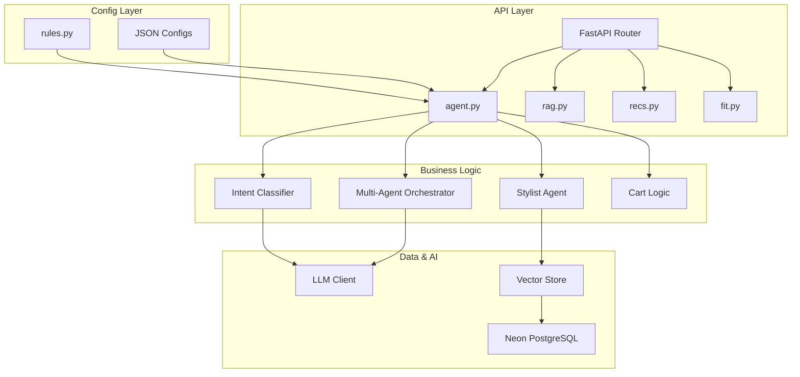

# COVE AI Core - Architecture Deep Dive & Code Quality Audit

> An SDE3-level analysis of your AI-powered fashion assistant backend

---

## 📊 Codebase Overview

| Metric | Value | Assessment |
|--------|-------|------------|
| **Total Python Lines** | 24,685 | Medium-sized codebase |
| **Largest File** | `agent.py` (3,235 lines) | ⚠️ God file - needs decomposition |
| **Functions in agent.py** | 49 | Too many responsibilities |
| **Print statements in routes** | 82 | ⚠️ Should use logging |
| **TODO comments** | 13 | Technical debt to address |

---

## 🏗️ Architecture Map



---

## 📁 Directory Structure Explained

```
app/
├── routes/           # API endpoints (FastAPI routers)
│   ├── agent.py      # Main chat agent (THE BRAIN) ⭐
│   ├── rag.py        # RAG queries for product info
│   ├── recs.py       # Product recommendations
│   ├── fit.py        # Size & fit recommendations
│   └── ...
│
├── agents/           # Specialized AI agents
│   ├── stylist_agent.py      # Fashion styling logic
│   ├── multi_agent_orchestrator.py  # Coordinates agents
│   ├── budget_agent.py       # Price-aware recommendations
│   └── outfit_builder_agent.py  # Complete look builder
│
├── core/             # Shared utilities
│   ├── rules.py      # Config-driven prompts/rules
│   ├── fuzzy.py      # Typo tolerance & corrections
│   ├── catalog.py    # Vocabulary caching
│   ├── llm_client.py # OpenAI/Anthropic wrapper
│   └── cache.py      # Response caching
│
├── mcp_agents/       # Model Context Protocol agents
│   └── intent_classifier/  # LLM intent classification
│
├── vector/           # Embedding & search
│   ├── store.py      # Vector similarity search
│   └── backend_loader.py  # Product embedding loader
│
└── services/         # Business services
    ├── fact_extractor.py   # User preference extraction
    └── context_manager.py  # Conversation context
```

---

## 🔍 Key Files Deep Dive

### 1. `app/routes/agent.py` - The Brain

This is your **main orchestrator** - it handles every user message and routes to the right logic.

**Flow:**
```
User Message → Intent Classification → Route to Handler → Response
```

**Key Functions:**
| Function | Purpose |
|----------|---------|
| `agent_query` | Main endpoint, entry point for all chat |
| `_agent_query_impl` | Core implementation with intent routing |
| `_call_llm_with_history` | Prepares context and calls LLM |
| `_call_recs_suggest` | Gets product recommendations |
| `_select_from_last_recs_via_llm` | Resolves "the second one" references |
| `_get_recently_discussed_product_index` | NEW: Context-aware cart add |

**⚠️ Issues Identified:**
1. **God File** - 3,235 lines is too large for one file
2. **Mixed Concerns** - Cart logic, recommendations, RAG all in one place
3. **49 functions** - Hard to navigate and test

### 2. `app/core/rules.py` - Config-Driven Logic

This file loads prompts and rules from JSON configs instead of hardcoding.

**Pattern (GOOD!):**
```python
# Instead of hardcoded strings:
prompt = get_prompt("greeting", default="Hello!")

# The actual prompt is in data/prompts.json
```

### 3. `app/core/fuzzy.py` - Typo Tolerance

Handles common typos and search normalization.

**Key Function:** `apply_common_corrections(word, config, catalog_types)`
- Returns corrected word if it's a known typo
- Respects catalog vocabulary (won't change "skirt" to "shirt")

### 4. `data/type_normalization_config.json` - Product Mapping

Defines how user terms map to catalog types:

```json
{
  "type_synonyms": {
    "tee": ["tshirt", "t-shirt", "top"],
    "hoodie": ["sweatshirt", "hoody"]
  },
  "broad_category_map": {
    "shoes": ["boots", "heels", "loafers", "sneakers"]
  }
}
```

---

## 🚨 Code Quality Issues Found

### Critical (Must Fix)

#### 1. Print Statements Instead of Logging
**Count:** 82 print statements in routes

**Example:**
```python
# ❌ BAD
print(f"🛒 [DEBUG] CART BRANCH TRIGGERED: wants_cart={wants_cart}")

# ✅ GOOD
log.debug("Cart branch triggered", extra={"wants_cart": wants_cart})
```

**Why it matters:**
- Prints go to stdout, can't be filtered by log level
- No timestamps or structured data
- Can't turn off in production

---

#### 2. God File Anti-Pattern
**File:** `agent.py` (3,235 lines, 49 functions)

**Recommendation:** Split into:
```
app/routes/
├── agent/
│   ├── __init__.py       # Router only
│   ├── cart.py           # Cart add/checkout logic
│   ├── recommendations.py # Product recommendations
│   ├── size_fit.py       # Size advisor
│   ├── smalltalk.py      # Greetings & chat
│   └── utils.py          # Shared helpers
```

---

#### 3. Inconsistent Error Handling

**Pattern seen:**
```python
# ❌ Silent failures
try:
    result = await do_something()
except Exception as e:
    log.warning("Failed: %s", e)
    return None  # Caller doesn't know what happened
```

**Better pattern:**
```python
# ✅ Explicit error types
class CartAddError(Exception):
    pass

try:
    result = await do_something()
except SpecificError as e:
    log.error("Cart add failed", exc_info=True)
    raise CartAddError(f"Could not add item: {e}")
```

---

### Medium Priority

#### 4. TODO Comments (13 found)

| Location | TODO |
|----------|------|
| `agent.py:2196` | "Get available colors from product variants" |
| `agent_stream.py:2x` | "Check user order history" / "Check from product catalog" |
| `product_recommender/` | Multiple database fetches not implemented |
| `context_manager.py` | "Get from cart service" |

---

#### 5. Magic Numbers & Strings

**Examples:**
```python
# ❌ Magic numbers
if len(history) > 10:
    ...

# ✅ Named constants
MAX_HISTORY_FOR_CONTEXT = 10
if len(history) > MAX_HISTORY_FOR_CONTEXT:
    ...
```

---

## 🎯 Refactoring Roadmap

### Phase 1: Quick Wins (1-2 hours)
- [ ] Replace all `print()` with `log.debug/info/warning`
- [ ] Extract constants to top of files
- [ ] Add missing type hints to public functions

### Phase 2: Structural (4-6 hours)
- [ ] Split `agent.py` into focused modules
- [ ] Create proper error hierarchy
- [ ] Consolidate config loading

### Phase 3: Performance (2-4 hours)
- [ ] Add caching for vocabulary fetches
- [ ] Optimize hot paths (intent classification)
- [ ] Review async patterns for parallelization

---

## 📚 Patterns You're Already Using (GOOD!)

### 1. Config-Driven Design
```python
# rules.py loads from JSON - no hardcoding!
prompt = get_prompt("cart_add_ambiguous", default="...")
```

### 2. Layered Architecture
```
Routes → Agents → Core → Data
```

### 3. Feature Flags
```python
if os.getenv("ENABLE_THINKING_DISPLAY", "false").lower() == "true":
    ...
```

### 4. Session Management
```python
_SESSION_RECS: Dict[str, List] = {}  # In-memory session storage
```

---

## 🔧 Recommended Immediate Actions

1. **Create a logging config** - Replace prints with structured logging
2. **Split agent.py** - Start with cart logic extraction
3. **Add integration tests** - Currently missing for critical paths
4. **Document the intent flow** - For onboarding new developers

---

> **Next Steps:** Review this document, then I can help you implement specific refactoring tasks.
