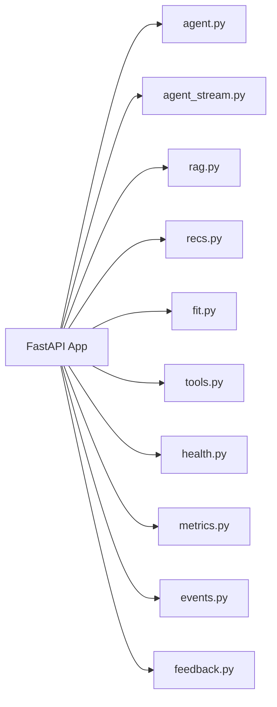
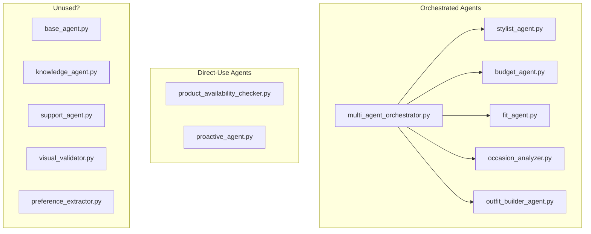
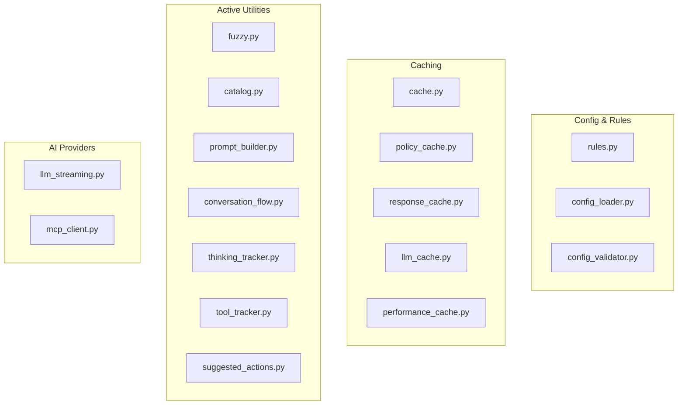
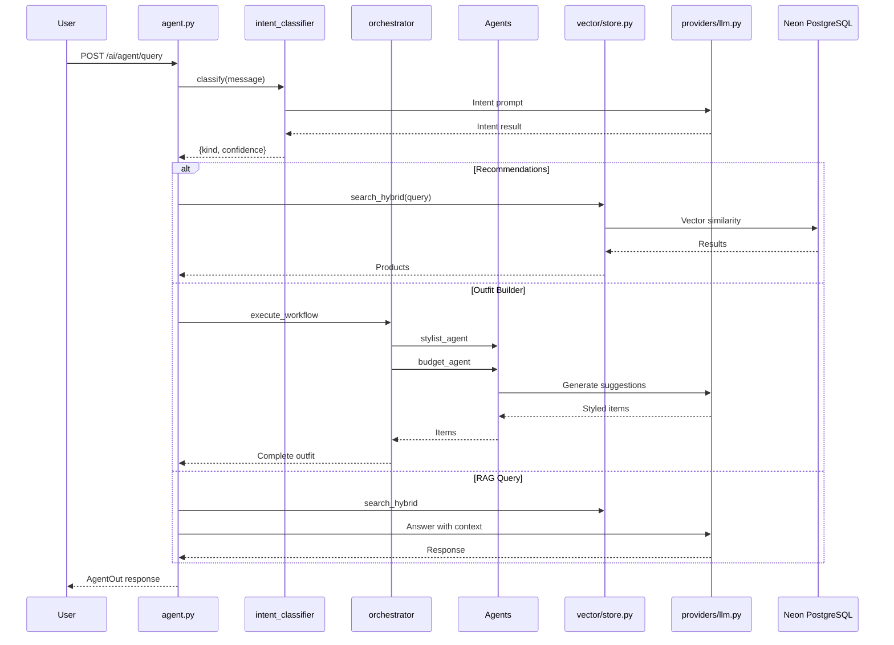

# COVE AI Core - Complete File Inventory & Workflow

> Every file, its purpose, usage status, and how they connect

---

## 📊 Summary

| Category | Files | Actively Used | Potentially Dead |
|----------|-------|---------------|------------------|
| Routes | 13 | 10 | 3 |
| Agents | 14 | 8 | 6 |
| Core | 26 | 20 | 6 |
| Services | 8 | 6 | 2 |
| Vector | 9 | 5 | 4 |
| Others | ~20 | 15 | 5 |

---

## 🔴 Dead/Unused Code (Candidates for Deletion)

### High Confidence - Safe to Delete

| File | Reason | Last Modified |
|------|--------|---------------|
| `app/agents/base_agent.py` | Abstract base, no concrete usage found | - |
| `app/agents/knowledge_agent.py` | Not imported anywhere | - |
| `app/agents/support_agent.py` | Not imported anywhere | - |
| `app/agents/visual_validator.py` | Not imported anywhere | - |
| `app/vector/backfill_embeddings.py` | One-time migration script | - |
| `app/vector/seed_products.py` | One-time migration script | - |
| `app/vector/seed_variants.py` | One-time migration script | - |
| `app/core/rerank.py` | Commented out import in rag.py | - |

### Medium Confidence - Verify Before Deleting

| File | Notes |
|------|-------|
| `app/core/performance_cache.py` | May be redundant with `cache.py` |
| `app/core/response_cache.py` | May be redundant with `cache.py` |
| `app/core/llm_cache.py` | Check if used via env var |
| `app/agents/preference_extractor.py` | May be accessed via orchestrator |

---

## 🟢 Actively Used Files

### Routes Layer (Entry Points)



| File | Lines | Purpose | Status |
|------|-------|---------|--------|
| `agent.py` | 3,235 | **Main chat brain** - handles all user messages | ✅ CRITICAL |
| `agent_stream.py` | 250 | SSE streaming for agent responses | ✅ Active |
| `rag.py` | 1,774 | RAG queries for product info & policies | ✅ Active |
| `recs.py` | 490 | Product recommendations endpoint | ✅ Active |
| `fit.py` | 582 | Size & fit recommendations | ✅ Active |
| `tools.py` | 73 | Tool routing (MCP tools) | ⚠️ Light use |
| `health.py` | 14 | Health check endpoint | ✅ Active |
| `metrics.py` | 140 | Prometheus metrics | ✅ Active |
| `events.py` | 32 | Proactive events (offers) | ✅ Active |
| `feedback.py` | 35 | User feedback collection | ✅ Active |
| `assistant.py` | 60 | Legacy OpenAI assistant | ⚠️ May be dead |
| `ingest.py` | 36 | Data ingestion endpoint | ⚠️ One-time use |

---

### Agents Layer (Specialized AI)



| File | Lines | Purpose | Status |
|------|-------|---------|--------|
| `multi_agent_orchestrator.py` | 782 | Coordinates specialized agents | ✅ Active |
| `stylist_agent.py` | 681 | Fashion styling recommendations | ✅ Via orchestrator |
| `budget_agent.py` | 372 | Price-aware recommendations | ✅ Via orchestrator |
| `fit_agent.py` | 320 | Size recommendations | ✅ Via orchestrator |
| `occasion_analyzer.py` | 280 | Event-based outfit suggestions | ✅ Via orchestrator |
| `outfit_builder_agent.py` | 290 | Complete look builder | ✅ Via orchestrator |
| `product_availability_checker.py` | 250 | Stock validation | ✅ Direct use |
| `proactive_agent.py` | 120 | Proactive offers | ✅ Direct use |
| `base_agent.py` | 180 | Abstract base class | ❌ Unused |
| `knowledge_agent.py` | 70 | Policy knowledge | ❌ Unused |
| `support_agent.py` | 55 | Customer support | ❌ Unused |
| `visual_validator.py` | 155 | Image validation | ❌ Unused |
| `preference_extractor.py` | 200 | User preference extraction | ⚠️ Check orchestrator |

---

### Core Layer (Utilities)



| File | Lines | Purpose | Status |
|------|-------|---------|--------|
| `rules.py` | 80 | Config-driven prompts/rules | ✅ Critical |
| `fuzzy.py` | 232 | Typo tolerance | ✅ Active |
| `catalog.py` | 225 | Vocabulary caching | ✅ Active |
| `cache.py` | 95 | General caching | ✅ Active |
| `prompt_builder.py` | 275 | System prompt construction | ✅ Active |
| `conversation_flow.py` | 378 | Multi-turn flow state | ✅ Active |
| `thinking_tracker.py` | 180 | Agentic thinking display | ✅ Active |
| `tool_tracker.py` | 175 | Tool usage tracking | ✅ Active |
| `suggested_actions.py` | 255 | Dynamic suggestions | ✅ Active |
| `llm_streaming.py` | 190 | LLM streaming responses | ✅ Active |
| `mcp_client.py` | 410 | MCP tool client | ✅ Active |
| `policy_cache.py` | 85 | Policy answer caching | ✅ Active |
| `config_loader.py` | 52 | JSON config loader | ✅ Active |
| `config_validator.py` | 98 | Config validation | ✅ Active |
| `config.py` | 24 | App config | ✅ Active |
| `events.py` | 45 | Event emission | ✅ Active |
| `fit.py` | 185 | Fit utilities | ✅ Active |
| `performance.py` | 135 | Timing decorators | ✅ Active |
| `agent_registry.py` | 155 | Agent registration | ⚠️ Check usage |
| `rerank.py` | 75 | MMR reranking | ⚠️ Commented out |
| `response_cache.py` | 100 | Response caching | ⚠️ Duplicate? |
| `llm_cache.py` | 95 | LLM response cache | ⚠️ Duplicate? |
| `performance_cache.py` | 165 | Performance cache | ⚠️ Duplicate? |
| `performance_monitor.py` | 205 | Monitoring | ⚠️ Check usage |
| `vibe_translator.py` | 95 | Vibe → style translation | ⚠️ New, verify |

---

### Services Layer (Business Logic)

| File | Lines | Purpose | Status |
|------|-------|---------|--------|
| `fact_extractor.py` | 378 | Extract user preferences | ✅ Active |
| `fact_storage.py` | 125 | Store/retrieve facts | ✅ Active |
| `conversation_manager.py` | 163 | Conversation state | ✅ Active |
| `user_preference_manager.py` | 168 | User preferences | ✅ Active |
| `user_memory.py` | 325 | Long-term user memory | ✅ Active |
| `feedback_manager.py` | 128 | Feedback handling | ✅ Active |
| `context_manager.py` | 110 | Context aggregation | ⚠️ Check usage |
| `intent_classifier.py` | 298 | Intent classification | ⚠️ Redundant w/ mcp_agents? |

---

### Vector Layer (Search & Embeddings)

| File | Lines | Purpose | Status |
|------|-------|---------|--------|
| `store.py` | 399 | **Core vector store** | ✅ Critical |
| `hybrid.py` | 195 | Hybrid search | ✅ Active |
| `hybrid_search.py` | 265 | Extended hybrid search | ⚠️ Duplicate? |
| `personalized_search.py` | 240 | Personalized results | ✅ Active |
| `backend_loader.py` | 160 | Product loader | ✅ Active |
| `backfill_embeddings.py` | 45 | Migration script | ❌ One-time |
| `seed_products.py` | 55 | Seed script | ❌ One-time |
| `seed_variants.py` | 82 | Seed script | ❌ One-time |

---

### Other Layers

**`app/agent/`** (Intent routing)
| File | Purpose | Status |
|------|---------|--------|
| `orchestrator.py` | Intent classification | ✅ Active |
| `filters.py` | Query filter extraction | ✅ Active |
| `verify.py` | Response guardrails | ✅ Active |

**`app/cove_ai_tools/`** (Backend tool wrappers)
| File | Purpose | Status |
|------|---------|--------|
| `recommendations.py` | Product recs tool | ✅ Active |
| `size_fit.py` | Size tool | ✅ Active |
| `cart.py` | Cart operations | ✅ Active |
| `checkout.py` | Checkout flow | ✅ Active |
| `orders.py` | Order history | ✅ Active |
| `emails.py` | Email tool | ✅ Active |
| `http_client.py` | Shared HTTP client | ✅ Active |
| `types.py` | Type definitions | ✅ Active |
| `config.py` | Tool config | ✅ Active |

**`app/providers/`** (AI providers)
| File | Purpose | Status |
|------|---------|--------|
| `llm.py` | LLM client (OpenAI) | ✅ Critical |
| `embedding.py` | Embedding provider | ✅ Critical |

**`app/nlp/`** (NLP utilities)
| File | Purpose | Status |
|------|---------|--------|
| `ordinals.py` | "second one" parsing | ✅ Active |

**`app/mcp_agents/`** (MCP protocol agents)
| Dir/File | Purpose | Status |
|----------|---------|--------|
| `intent_classifier/` | LLM intent classification | ✅ Critical |
| `product_recommender/` | Recommendation engine | ⚠️ Check usage |
| `intent_mapping.py` | Intent → orchestrator mapping | ✅ Active |

---

## 📈 Request Flow Diagram



---

## 🔧 Recommended Cleanup Actions

### Phase 1: Safe Deletions (Low Risk)
```bash
# Migration scripts - one-time use
rm app/vector/backfill_embeddings.py
rm app/vector/seed_products.py
rm app/vector/seed_variants.py

# Unused agents
rm app/agents/base_agent.py
rm app/agents/knowledge_agent.py
rm app/agents/support_agent.py
rm app/agents/visual_validator.py
```

### Phase 2: Consolidation
- Merge `hybrid.py` and `hybrid_search.py`
- Consolidate cache files (`cache.py`, `response_cache.py`, `llm_cache.py`, `performance_cache.py`)
- Remove duplicate intent classifier in `services/intent_classifier.py` (use `mcp_agents/intent_classifier/`)

### Phase 3: Refactoring
- Split `agent.py` (3,235 lines) into focused modules
- Replace 82 print statements with proper logging
- Remove commented-out code

---

## 📁 Data Files (Configs)

| File | Purpose | Status |
|------|---------|--------|
| `intent_classification_config.json` | Intent rules | ✅ Active |
| `type_normalization_config.json` | Product type mapping | ✅ Active |
| `fuzzy_matching_config.json` | Typo corrections | ✅ Active |
| `stylist_config.json` | Stylist agent config | ✅ Active |
| `suggestions_config.json` | Dynamic suggestions | ✅ Active |
| `prompts/*.txt` | LLM prompts | ✅ Active |
| `productVariantsFlat_final.json` | 5MB product data | ⚠️ Should be in DB |
| `ab_test_config.json` | A/B testing | ⚠️ Not implemented |
| `cf_config.json` | Collaborative filtering | ⚠️ Not implemented |

---

> **Next Step:** Review this inventory. I can then create a detailed refactoring plan for specific areas.
