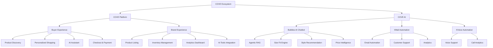
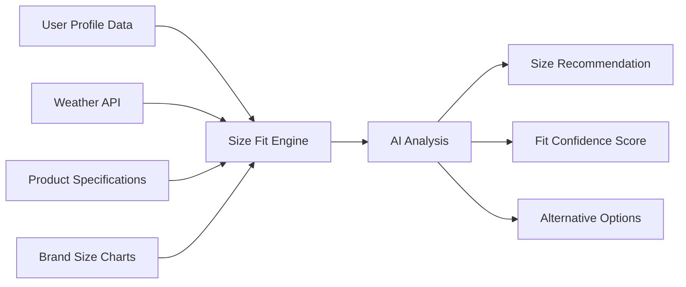
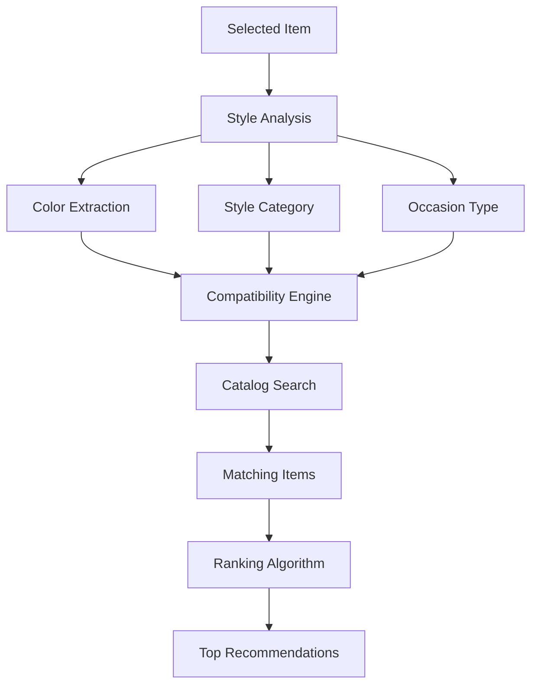
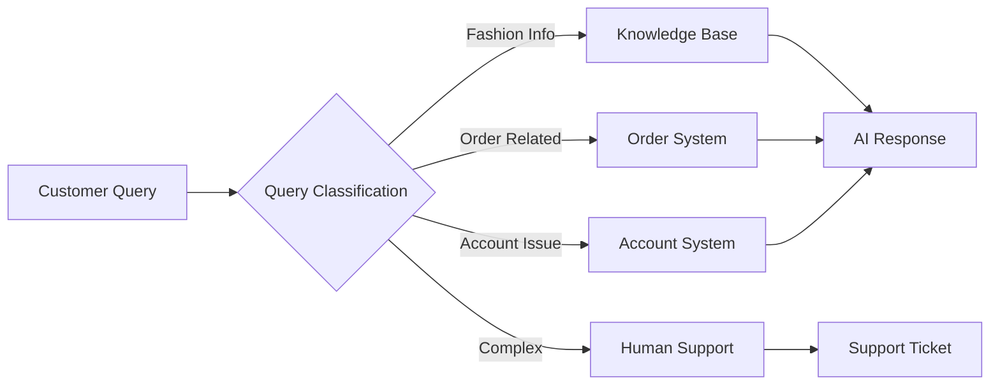
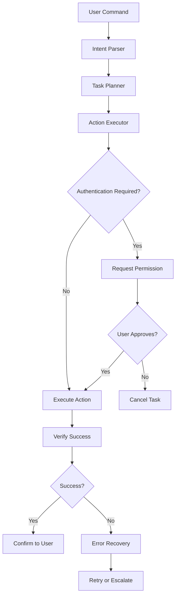
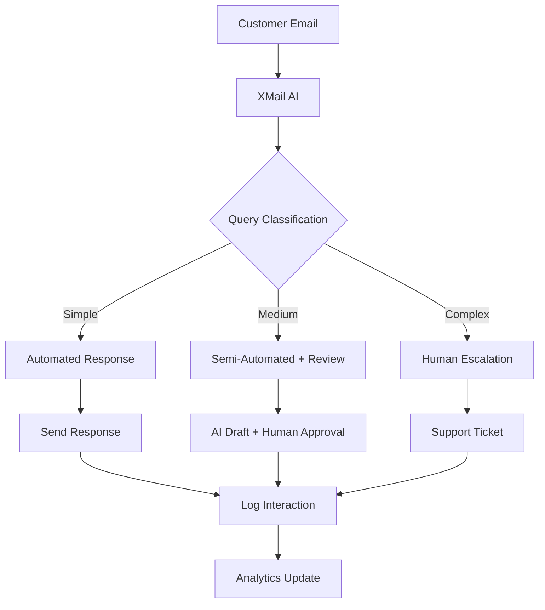
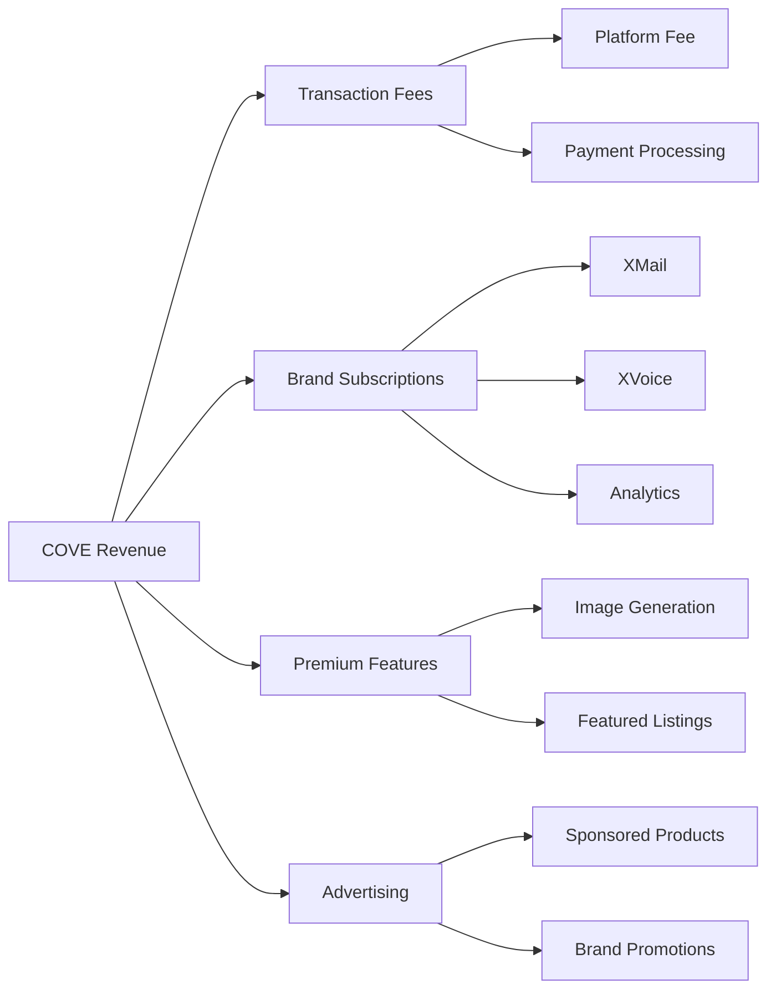
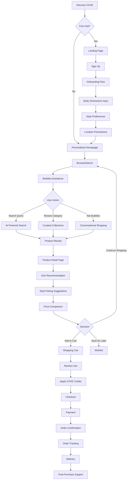
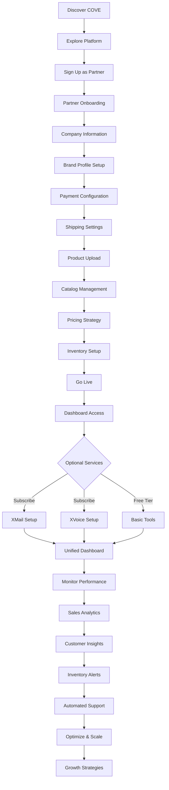
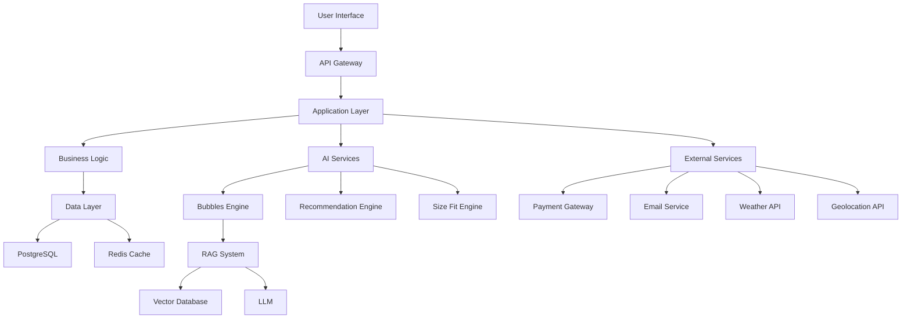

# COVE
## Europe's AI-Driven Fashion Marketplace

---

## 🎯 Executive Overview

**COVE** is a revolutionary dual-sided AI-powered fashion marketplace connecting European buyers with fashion brands of all sizes. We leverage cutting-edge artificial intelligence through our proprietary **COVE AI** technology suite to deliver hyper-personalized shopping experiences and comprehensive brand management automation.

### Company Identity

- **Brand Name:** COVE
- **Primary Domain:** meincove.com
- **AI Technology Domain:** meincove.ai
- **Market:** European Union (with global expansion roadmap)
- **Industry:** Fashion E-commerce & AI Technology

### Mission Statement

To revolutionize the online fashion retail experience by creating an AI-first marketplace that delivers unprecedented personalization for buyers while providing brands with powerful automation tools to scale their business.

### Market Position

Europe's first AI-driven fashion marketplace platform, uniquely positioned at the intersection of advanced artificial intelligence and fashion retail.

---

## 🏗️ Platform Architecture

### Ecosystem Overview



### Platform Stakeholders

#### Buyers (Customers)
Fashion consumers seeking personalized shopping experiences with access to curated brand selections and AI-powered assistance.

#### Brands (COVE Partners)
Fashion brands seeking to expand their market reach through an AI-enhanced marketplace platform with integrated business tools.

---

## 🤖 COVE AI - Technology Suite

### Overview

COVE AI is our proprietary artificial intelligence technology company, operating as a separate entity while being seamlessly integrated into the COVE platform. COVE AI provides three core technology products:

1. **Bubbles** - Agentic RAG AI Chatbot
2. **XMail** - Email Automation System
3. **XVoice** - Voice Automation System

---

## 💬 Bubbles - Agentic RAG AI Chatbot

### Technology Foundation

Bubbles is powered by advanced Retrieval-Augmented Generation (RAG) technology combined with agentic AI capabilities, enabling autonomous decision-making and task execution within the COVE platform.

### Core Capabilities

#### 1. Size Fit Recommendation Engine

**Technology:**
- AI-powered body dimension analysis
- BMI calculation algorithms
- Layering preference modeling
- Climate-aware sizing adjustments

**Data Inputs:**
- User body dimensions (height, weight, measurements)
- Geolocation data (with permission)
- Local temperature and weather data (API integration)
- Layering preferences (single-layer vs multi-layer)
- Historical purchase data
- Return/exchange patterns

**Output:**
- Precise size recommendations per brand
- Fit confidence scores
- Alternative size suggestions
- Layering-specific adjustments

**Value Proposition:**
- Reduces product returns
- Increases customer satisfaction
- Improves conversion rates
- Builds customer trust



---

#### 2. Product Recommendation System

**Technology:**
- Semantic search across entire catalog
- Collaborative filtering
- Content-based filtering
- Real-time preference learning

**Recommendation Types:**
- Similar products (same category)
- Complementary products (cross-category)
- Style-matched alternatives
- Price-point alternatives
- Trending items in user's preference zone

**Personalization Factors:**
- Browsing history
- Purchase history
- Saved items
- Search queries
- Time spent on products
- Price sensitivity
- Brand preferences
- Style preferences

---

#### 3. Intelligent Catalog Search

**Technology:**
- Natural language processing
- Semantic understanding
- Multi-brand catalog indexing
- Real-time inventory awareness

**Search Capabilities:**
- Conversational queries ("Show me brown hoodies under €50")
- Visual attribute search ("Oversized fit with vintage wash")
- Contextual search ("Warm jacket for Berlin winter")
- Cross-brand search
- Availability-aware results

**Search Enhancement:**
- Auto-complete with AI predictions
- Query refinement suggestions
- Filter recommendations
- Search result personalization

---

#### 4. Agentic Routing & Task Execution

**Autonomous Capabilities:**
- Intent recognition and classification
- Multi-step task planning
- Cross-system navigation
- Authentication handling
- Error recovery

**Executable Tasks:**
- Add items to cart
- Apply discount codes
- Initiate checkout
- Track orders
- Modify cart contents
- Save items to wishlist
- Compare products
- Navigate to specific pages

**Example Interaction Flow:**
```
User: "Add this brown hoodie to my cart and find matching pants"
↓
Bubbles AI Processing:
1. Identifies product (brown hoodie)
2. Adds to cart
3. Analyzes style attributes
4. Searches catalog for matching pants
5. Filters by color compatibility
6. Ranks by style match
7. Presents top 3 options
↓
Bubbles Response: "I've added the hoodie to your cart. Here are 3 matching pants options..."
```

---

#### 5. Style Pairing Recommendation

**Technology:**
- Fashion knowledge graph
- Color theory algorithms
- Style compatibility scoring
- Trend analysis integration

**Pairing Categories:**
- Complete outfits (top + bottom + shoes)
- Seasonal combinations
- Occasion-based styling
- Layering suggestions
- Accessory matching

**Personalization:**
- User's existing wardrobe (if shared)
- Style preferences
- Budget constraints
- Climate considerations
- Occasion requirements

**Business Impact:**
- Increases average order value
- Improves customer engagement
- Reduces decision fatigue
- Enhances shopping experience



---

#### 6. Cross-Brand Price Comparison

**Technology:**
- Real-time price monitoring
- Product similarity matching
- Value scoring algorithms

**Comparison Metrics:**
- Base price
- Discounts and promotions
- Shipping costs
- Total cost to customer
- Value-for-money score

**Transparency Features:**
- Side-by-side comparisons
- Price history graphs
- Best deal highlighting
- Savings calculations

**Customer Benefits:**
- Informed purchasing decisions
- Maximum value discovery
- Trust building
- Price confidence

---

#### 7. General Q&A and Customer Support

**Knowledge Domains:**

**Fashion Knowledge:**
- Fabric types and care
- Style terminology
- Trend information
- Sizing standards
- Brand information

**Platform Support:**
- Account management
- Order tracking
- Return/exchange processes
- Payment methods
- Shipping information

**Automated Actions:**
- Password reset initiation
- Order status lookup
- Return label generation
- Support ticket creation
- Email notifications

**Escalation Protocol:**
- Complex queries → Human support
- Complaint handling → Priority queue
- Technical issues → Technical team



---

#### 8. AI Image Generation

**Technology:**
- Generative AI models
- Fashion-specific training
- Style transfer capabilities

**Use Cases:**
- Outfit visualization
- Color variation previews
- Style inspiration
- Virtual try-on concepts
- Mood board creation

**Pricing Model:**

| Tier | Daily Limit | Price |
|------|-------------|-------|
| **Free** | 2 generations | €0 |
| **Premium** | Unlimited | Subscription-based |

**Generation Options:**
- Outfit combinations
- Color swaps
- Style variations
- Seasonal adaptations
- Occasion-specific looks

---

### Bubbles Personalization Engine

#### Data Collection (User Permission Required)

**Body Metrics:**
- Height
- Weight
- Chest/Bust measurement
- Waist measurement
- Hip measurement
- Inseam length
- Shoulder width
- Arm length

**Location Data:**
- Current location (geolocation API)
- Shipping address
- Climate zone

**Environmental Data:**
- Local temperature (weather API)
- Seasonal weather patterns
- Humidity levels
- Typical weather conditions

**Behavioral Data:**
- Browsing patterns
- Search history
- Purchase history
- Cart abandonment patterns
- Time spent on products
- Interaction with recommendations

**Preference Data:**
- Layering preferences
- Style preferences
- Brand preferences
- Price sensitivity
- Color preferences
- Fit preferences (tight/regular/loose)

#### Privacy & Data Security

- GDPR compliant data handling
- User consent management
- Data encryption
- Anonymization options
- Data deletion rights
- Transparent data usage policies

---

### Bubbles Feature Summary Table

| Feature | Technology | Data Inputs | Output | Business Value |
|---------|-----------|-------------|--------|----------------|
| **Size Fit** | AI + BMI algorithms | Body metrics, weather, layering | Size recommendation + confidence | Reduced returns |
| **Product Recommendations** | Collaborative + content filtering | Behavior, preferences, catalog | Personalized suggestions | Increased discovery |
| **Catalog Search** | NLP + semantic search | Query, inventory, preferences | Relevant results | Faster conversion |
| **Agentic Routing** | Intent classification + automation | User commands | Task execution | Seamless UX |
| **Style Pairing** | Fashion graph + color theory | Selected item, preferences | Complete outfits | Higher basket value |
| **Price Comparison** | Real-time monitoring | Catalog prices, promotions | Best deals | Trust building |
| **Q&A Support** | Knowledge base + NLP | Customer queries | Automated answers | Reduced support costs |
| **Image Generation** | Generative AI | Style inputs, preferences | Visual concepts | Engagement boost |

---

## 🤖 Agentic AI - Autonomous Task Execution

### Core Functionality

The Agentic AI system enables Bubbles to autonomously execute tasks within the COVE platform, acting as a digital assistant that can navigate, interact, and complete multi-step processes on behalf of users.

### Technical Architecture



### Executable Actions

#### Shopping Actions
- Add product to cart
- Remove from cart
- Update quantities
- Apply discount codes
- Save to wishlist
- Compare products
- Share products

#### Navigation Actions
- Navigate to product pages
- Open category pages
- Access user account
- View order history
- Open checkout
- Navigate to brand pages

#### Account Actions
- Update profile information
- Change preferences
- Manage addresses
- View saved items
- Access order tracking

#### Checkout Actions
- Select shipping method
- Apply payment method
- Review order summary
- Confirm purchase (with explicit user approval)

### Safety & Permissions

**Automatic Actions (No Permission Required):**
- Navigation
- Search
- Product viewing
- Cart additions
- Wishlist management

**Permission-Required Actions:**
- Payment processing
- Order confirmation
- Account changes
- Address modifications
- Subscription changes

### User Experience Flow

```
User: "Find me a black leather jacket under €200 and add it to my cart"
↓
Agentic AI Process:
1. Parse intent: Search + Filter + Add to cart
2. Execute search with filters
3. Rank results by relevance
4. Present top match
5. Await user confirmation
6. Add to cart
7. Confirm completion
↓
Bubbles: "I found this black leather jacket from [Brand] for €179. I've added it to your cart."
```

---

## 📧 XMail - Email Automation for Brands

### Product Overview

XMail is COVE AI's email automation solution designed specifically for fashion brands operating on the COVE platform. It provides AI-powered customer support automation, reducing operational burden while maintaining high-quality customer service.

### Core Features

#### 1. Branded Email Infrastructure

**Email Format:**
```
[BrandName]-Xmail-support@meincove.com
```

**Benefits:**
- Professional branded presence
- Centralized management
- COVE infrastructure reliability
- Spam protection
- Deliverability optimization

#### 2. Automated Customer Support

**AI Capabilities:**
- Query classification
- Intent recognition
- Automated response generation
- Issue resolution
- Escalation management

**Supported Query Types:**

| Query Category | Examples | Resolution Method |
|----------------|----------|-------------------|
| **Order Status** | "Where is my order?", "Tracking number?" | Automated lookup + response |
| **Returns** | "How do I return?", "Refund status?" | Policy info + return label generation |
| **Product Info** | "Size availability?", "Material details?" | Catalog lookup + detailed response |
| **Account Issues** | "Reset password", "Update email" | Automated action + confirmation |
| **Shipping** | "Delivery time?", "Shipping cost?" | Calculation + information |
| **Payments** | "Payment failed", "Invoice request" | Status check + resolution |
| **General** | "Store hours?", "Contact info?" | Knowledge base response |

#### 3. Issue Resolution System

**Resolution Levels:**

**Level 1 - Automated (80% of queries):**
- Information requests
- Status checks
- Simple troubleshooting
- Policy questions

**Level 2 - Semi-Automated (15% of queries):**
- Returns/exchanges
- Payment issues
- Shipping problems
- Product concerns

**Level 3 - Human Escalation (5% of queries):**
- Complex complaints
- Legal matters
- Custom requests
- Unusual situations



#### 4. Analytics Dashboard

**Real-Time Metrics:**

**Query Analytics:**
- Total queries received
- Queries by category
- Response time (average/median)
- Resolution rate
- Escalation rate
- Customer satisfaction scores

**Performance Metrics:**
- Automation success rate
- First-contact resolution
- Average handling time
- Response accuracy
- Customer feedback ratings

**Business Intelligence:**

| Metric | Description | Business Value |
|--------|-------------|----------------|
| **Query Volume Trends** | Daily/weekly/monthly patterns | Resource planning |
| **Peak Times** | High-volume periods | Staffing optimization |
| **Common Issues** | Frequently asked questions | Product/process improvement |
| **Resolution Efficiency** | Time to resolve by category | Performance tracking |
| **Customer Sentiment** | Satisfaction trends | Service quality monitoring |

#### 5. Inventory Intelligence

**Automated Alerts:**

**Low Stock Warnings:**
- Products below threshold
- Trending items at risk
- Seasonal demand predictions

**Performance Insights:**
- High views, low conversion products
- Best-selling items
- Slow-moving inventory
- Price optimization suggestions

**Conversion Analytics:**
- Product page views
- Add-to-cart rate
- Checkout abandonment
- Purchase completion

**Sample Dashboard View:**

| Product | Views | Adds to Cart | Purchases | Conversion | Stock | Alert |
|---------|-------|--------------|-----------|------------|-------|-------|
| Blue Denim Jacket | 1,247 | 89 | 12 | 0.96% | 3 units | 🔴 Low Stock |
| Black Hoodie | 2,103 | 456 | 234 | 11.1% | 45 units | 🟢 Trending |
| White Sneakers | 892 | 234 | 5 | 0.56% | 67 units | 🟡 Low Conversion |

#### 6. Customer Communication Tracking

**Conversation Logging:**
- Complete email thread history
- AI response tracking
- Human intervention points
- Resolution outcomes
- Customer feedback

**Reporting:**
- Daily summary emails
- Weekly performance reports
- Monthly analytics review
- Custom report generation

### XMail Pricing Tiers

#### XMail Standard

**Price:** €49/month

**Features:**
- Branded email address
- Automated response system
- Basic analytics dashboard
- Up to 500 queries/month
- Email support
- 48-hour response time for escalations

**Ideal For:**
- Small brands
- New COVE partners
- Testing automation

---

#### XMail Pro

**Price:** €99/month

**Features:**
- Everything in Standard
- Advanced analytics & reporting
- Unlimited queries
- Priority escalation handling
- **XVoice Lite included**
- Custom response templates
- API access
- Dedicated account manager
- 24-hour response time for escalations

**Ideal For:**
- Growing brands
- High-volume sellers
- Multi-channel brands

---

### XMail Technical Specifications

**Email Processing:**
- Average response time: <2 minutes
- Accuracy rate: 95%+
- Uptime: 99.9% SLA
- Language support: Multi-language (EU languages)

**Integration:**
- COVE platform native integration
- Order management system sync
- Inventory system connection
- CRM compatibility

**Security:**
- End-to-end encryption
- GDPR compliance
- Data privacy protection
- Secure authentication

---

## 🎙️ XVoice - Voice Automation System

### Product Overview

XVoice is COVE AI's voice-based customer support automation system, enabling brands to provide phone support powered by advanced AI voice technology.

### Core Capabilities

#### 1. Voice Query Handling

**Technology:**
- Speech-to-text conversion
- Natural language understanding
- Intent recognition
- Context awareness
- Multi-turn conversation handling

**Supported Interactions:**
- Order status inquiries
- Product information requests
- Return/exchange initiation
- Account assistance
- General support questions

#### 2. Conversation Intelligence

**Real-Time Processing:**
- Voice sentiment analysis
- Emotion detection
- Urgency assessment
- Customer satisfaction prediction

**Transcription & Analysis:**
- Full conversation transcription
- Key point extraction
- Action item identification
- Follow-up requirement detection

#### 3. Integration with XMail

**Unified Dashboard:**
- Combined email + voice analytics
- Cross-channel customer history
- Unified reporting
- Seamless escalation between channels

**Data Synchronization:**
- Customer profile updates
- Issue tracking across channels
- Resolution history
- Preference learning

### XVoice Pricing Tiers

#### XVoice Lite

**Price:** Included with XMail Pro (€99/month)

**Features:**
- Basic voice support
- Up to 100 calls/month
- Standard transcription
- Basic analytics
- Email integration

**Call Handling:**
- Simple queries
- Information requests
- Status checks
- Basic troubleshooting

---

#### XVoice Pro

**Price:** +€49/month (€148/month total with XMail Pro)

**Features:**
- Everything in XVoice Lite
- Unlimited calls
- Advanced voice analytics
- Sentiment analysis
- Multi-language support (EU languages)
- Custom voice personas
- Priority routing
- Advanced reporting
- Call recording & archiving
- API access

**Advanced Capabilities:**
- Complex query handling
- Multi-step issue resolution
- Proactive follow-ups
- Custom workflows

---

### XVoice Analytics

**Call Metrics:**
- Total calls received
- Average call duration
- Resolution rate
- Escalation rate
- Customer satisfaction scores
- Call abandonment rate

**Voice Analytics:**
- Sentiment trends
- Common topics
- Peak call times
- Language preferences
- Customer emotion patterns

**Business Intelligence:**
- Call-to-resolution time
- First-call resolution rate
- Callback requirements
- Issue category distribution
- Agent performance (for escalated calls)

---

### XVoice Technical Specifications

**Voice Quality:**
- HD voice clarity
- Natural speech synthesis
- Multi-accent support
- Background noise filtering

**Performance:**
- Response latency: <500ms
- Accuracy: 90%+ intent recognition
- Uptime: 99.9% SLA
- Concurrent call capacity: Scalable

**Languages Supported:**
- English
- German
- French
- Spanish
- Italian
- Dutch
- Portuguese
- (Additional languages on request)

---

## 💰 Revenue Model

### Platform Economics

COVE operates on a commission-based model with optional premium services for brands.

### Phase 1: Market Entry & Growth

**For Brands:**
- ✅ **Free Platform Access**
  - Product listing
  - Inventory management
  - Basic analytics
  - Payment processing
  - Customer management

- ✅ **Commission-Based Revenue**
  - Platform fee per transaction
  - Selling commission
  - Payment processing fee
  - *Specific percentages determined by market conditions and brand tier*

**For Buyers:**
- ✅ **Free Shopping Experience**
  - Unlimited browsing
  - Bubbles AI assistance
  - Size fit recommendations
  - Product recommendations
  - Price comparisons
  - General Q&A support

- ✅ **Freemium AI Features**
  - Image generation: 2 free/day
  - Premium: Unlimited access

### Phase 2: Value-Added Services

**For Brands:**

| Service | Pricing | Description |
|---------|---------|-------------|
| **XMail Standard** | €49/month | Email automation, basic analytics |
| **XMail Pro** | €99/month | Advanced analytics, XVoice Lite |
| **XVoice Pro** | +€49/month | Unlimited voice support, advanced analytics |
| **Featured Listings** | Variable | Premium product placement |
| **Advanced Analytics** | €29/month | Deep business intelligence |
| **Marketing Tools** | €39/month | Campaign management, promotions |

**For Buyers:**

**COVE Credits System:**
- Promotional credits for purchases
- Example: Spend €60, receive €6 COVE credit
- Usable on future purchases
- Drives customer retention
- Promotes partner brands

**Premium Subscriptions (Future):**
- Early access to sales
- Exclusive discounts
- Priority customer support
- Free shipping benefits

### Revenue Streams Summary



---

## 🎯 Market Positioning

### Target Market

**Geographic Focus:**
- Primary: European Union
- Secondary: European Economic Area
- Future: Global expansion

**Market Segments:**

**Brands:**
- Fashion brands of all sizes
- Regional and international brands
- Established and emerging designers
- Multi-category fashion retailers

**Consumers:**
- Fashion-conscious shoppers
- Value-seeking buyers
- Tech-savvy millennials and Gen Z
- Quality-focused consumers
- Sustainable fashion advocates

### Competitive Landscape

**Direct Competitors:**
- Zalando (EU marketplace)
- ASOS (Global fashion)
- Farfetch (Luxury focus)
- Vinted (Second-hand)

**Indirect Competitors:**
- Amazon Fashion
- Individual brand websites
- Shopify-powered stores
- Social commerce platforms

### COVE Differentiation

**Unique Value Propositions:**

1. **AI-First Platform**
   - Every interaction powered by Bubbles
   - Hyper-personalized experiences
   - Autonomous task execution
   - Predictive recommendations

2. **Comprehensive Brand Tools**
   - XMail email automation
   - XVoice voice support
   - Integrated analytics
   - Operational efficiency

3. **Personalization Depth**
   - Body-specific recommendations
   - Weather-aware suggestions
   - Style intelligence
   - Price optimization

4. **Platform Accessibility**
   - Low barrier to entry
   - Free basic access
   - Scalable pricing
   - Growth-friendly model

5. **European Focus**
   - EU-centric operations
   - Local market understanding
   - Regional brand support
   - Compliance-first approach

---

## 👥 User Experience Journeys

### Buyer Journey



### Detailed Buyer Touchpoints

**Discovery Phase:**
- Landing page with AI showcase
- Category browsing
- Search functionality
- Bubbles introduction

**Consideration Phase:**
- Product detail pages
- Size fit recommendations
- Style pairing suggestions
- Price comparisons
- Reviews and ratings
- Bubbles Q&A

**Purchase Phase:**
- Cart management
- COVE credits application
- Checkout process
- Payment options
- Order confirmation

**Post-Purchase Phase:**
- Order tracking
- Delivery updates
- Return/exchange support
- Feedback collection
- Repeat purchase incentives

---

### Brand Journey



### Detailed Brand Touchpoints

**Discovery & Onboarding:**
- Partner information portal
- Application process
- Brand verification
- Contract signing
- Platform training

**Setup Phase:**
- Brand profile creation
- Product catalog upload
- Pricing configuration
- Inventory management
- Shipping setup
- Payment integration

**Operations Phase:**
- Order management
- Inventory tracking
- Customer communication
- Analytics monitoring
- Performance optimization

**Growth Phase:**
- XMail automation
- XVoice integration
- Advanced analytics
- Marketing tools
- Featured placements

---

## 📊 Platform Features Matrix

### Buyer Features

| Feature Category | Features | AI Enhancement | Value |
|-----------------|----------|----------------|-------|
| **Discovery** | Search, Browse, Categories | Semantic search, Personalization | Faster product finding |
| **Recommendations** | Similar products, Style pairing | Collaborative filtering, Style AI | Increased discovery |
| **Sizing** | Size charts, Fit guide | Body analysis, Climate-aware | Reduced returns |
| **Shopping** | Cart, Wishlist, Compare | Smart suggestions, Price tracking | Better decisions |
| **Support** | Chat, FAQ, Help center | Bubbles AI, 24/7 availability | Instant assistance |
| **Checkout** | Payment, Shipping, Tracking | Saved preferences, Auto-fill | Faster checkout |
| **Account** | Profile, Orders, Preferences | Personalization learning | Tailored experience |

### Brand Features

| Feature Category | Features | AI Enhancement | Value |
|-----------------|----------|----------------|-------|
| **Catalog** | Product upload, Inventory | Auto-categorization, Optimization | Efficient management |
| **Orders** | Order processing, Fulfillment | Automated workflows, Alerts | Streamlined operations |
| **Analytics** | Sales reports, Performance | Predictive insights, Trends | Data-driven decisions |
| **Marketing** | Promotions, Featured listings | Targeting optimization | Better ROI |
| **Support** | Customer service, Returns | XMail automation, XVoice | Reduced workload |
| **Payments** | Transaction processing, Payouts | Automated reconciliation | Financial clarity |
| **Growth** | Performance tools, Insights | AI recommendations | Strategic scaling |

---

## 🔧 Technical Architecture

### Platform Stack

**Frontend:**
- Next.js (React framework)
- TypeScript
- Tailwind CSS
- Real-time updates

**Backend:**
- Django (Python)
- PostgreSQL database
- Redis caching
- RESTful APIs

**AI/ML:**
- Custom RAG implementation
- LLM integration
- Vector databases
- Real-time inference

**Infrastructure:**
- Cloud hosting (scalable)
- CDN for assets
- Load balancing
- Auto-scaling

**Integrations:**
- Clerk (Authentication)
- Stripe (Payments)
- Weather APIs
- Geolocation services
- Email services
- Voice services

### Data Flow Architecture



---

## 📈 Success Metrics & KPIs

### Platform Health Metrics

**User Engagement:**
- Daily Active Users (DAU)
- Monthly Active Users (MAU)
- Session duration
- Pages per session
- Return visitor rate

**Transaction Metrics:**
- Gross Merchandise Value (GMV)
- Average Order Value (AOV)
- Conversion rate
- Cart abandonment rate
- Repeat purchase rate

**Brand Metrics:**
- Active brands
- Products listed
- Brands with sales (monthly)
- Average products per brand
- Brand retention rate

### AI Performance Metrics

**Bubbles Engagement:**
- Chat initiation rate
- Messages per session
- Task completion rate
- User satisfaction score
- Recommendation acceptance rate

**Size Fit Accuracy:**
- Return rate for sizing issues
- Size recommendation usage
- Fit satisfaction scores
- Alternative size selection rate

**Recommendation Performance:**
- Click-through rate (CTR)
- Conversion from recommendations
- Average basket size increase
- Cross-sell success rate

**XMail Performance:**
- Query volume
- Automated resolution rate
- Response time
- Customer satisfaction
- Escalation rate

**XVoice Performance:**
- Call volume
- Average call duration
- First-call resolution
- Customer satisfaction
- Automation success rate

### Business Metrics

**Revenue:**
- Monthly Recurring Revenue (MRR)
- Transaction revenue
- Subscription revenue
- Year-over-Year growth

**Customer Acquisition:**
- Customer Acquisition Cost (CAC)
- Lifetime Value (LTV)
- LTV:CAC ratio
- Organic vs. paid traffic

**Operational:**
- Platform uptime
- API response time
- Support ticket volume
- Resolution time

---

## 🌍 Market Opportunity

### European Fashion E-commerce Market

**Market Size:**
- EU fashion e-commerce: €100B+ annually
- Growing at 8-10% CAGR
- Mobile commerce increasing
- Cross-border shopping rising

**Consumer Trends:**
- Personalization demand
- AI acceptance growing
- Sustainability focus
- Quality over quantity
- Omnichannel expectations

**Brand Challenges:**
- Customer acquisition costs rising
- Competition intensifying
- Operational complexity
- Technology investment required
- Customer support scaling

**COVE Opportunity:**
- Address personalization gap
- Reduce operational burden
- Enable brand growth
- Provide competitive AI tools
- Lower entry barriers

---

## 🚀 Growth Strategy

### Phase 1: Launch (Months 1-6)

**Objectives:**
- Platform launch
- Initial brand onboarding
- User acquisition start
- Technology validation

**Key Activities:**
- Onboard 10-20 pilot brands
- Acquire first 1,000 users
- Refine AI models
- Gather feedback
- Iterate on features

**Success Metrics:**
- Platform stability
- User satisfaction >4.0/5
- Brand satisfaction >4.0/5
- GMV: €50K-100K

### Phase 2: Growth (Months 7-18)

**Objectives:**
- Scale brand network
- Expand user base
- Launch premium services
- Optimize operations

**Key Activities:**
- Onboard 100+ brands
- Acquire 50,000+ users
- Launch XMail
- Launch XVoice Lite
- Marketing campaigns
- Partnership development

**Success Metrics:**
- 100+ active brands
- 50K+ registered users
- GMV: €1M+/month
- 20+ XMail subscribers

### Phase 3: Scale (Months 19-36)

**Objectives:**
- Market leadership
- Geographic expansion
- Feature expansion
- Profitability

**Key Activities:**
- 500+ brands
- 250K+ users
- Multi-country expansion
- Mobile app launch
- Advanced AI features
- Strategic partnerships

**Success Metrics:**
- Market recognition
- GMV: €5M+/month
- Profitability achieved
- 100+ premium subscribers

---

## 🎯 Strategic Vision

### 3-Year Vision

**Year 1: Establish**
- Launch platform
- Prove AI value
- Build brand network
- Acquire users
- Validate business model

**Year 2: Grow**
- Scale operations
- Expand services
- Increase market share
- Optimize profitability
- Build brand recognition

**Year 3: Lead**
- Market leadership in EU
- Geographic expansion
- Feature innovation
- Strategic partnerships
- Sustainable profitability

### Long-Term Ambition

**COVE's North Star:**
To become Europe's leading AI-powered fashion marketplace, where every fashion purchase is smarter, more personal, and more satisfying through the power of artificial intelligence.

**Impact Goals:**
- Empower thousands of brands to reach European consumers
- Serve millions of shoppers with personalized experiences
- Set the standard for AI in fashion e-commerce
- Drive innovation in online retail
- Create a sustainable, profitable business

---

## 📞 Platform Contact & Information

**Company:** COVE  
**Website:** meincove.com  
**AI Technology:** meincove.ai  
**Industry:** Fashion E-commerce & AI Technology  
**Market:** European Union  

---

*This document represents the comprehensive vision and technical specification for the COVE platform and COVE AI technology suite. All features, pricing, and specifications are subject to market conditions and business requirements.*

*Document Version: 2.0*  
*Last Updated: December 2024*  
*Prepared for: Investor Relations & Strategic Communications*
