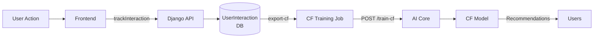

# Option B: User Interaction Tracking - Implementation Plan

**Goal**: Capture real user behavior to replace synthetic CF data

**Research-Backed**: Based on 2024 e-commerce tracking best practices

---

## Research Findings (Dec 2024)

### Key Insights

**1. Multi-Behavior Tracking** (GA4 Event Model)
- Track multiple event types: `view_item`, `add_to_cart`, `begin_checkout`, `purchase`
- Each event provides different signal strength for CF
- Multi-behavior alignment improves recommendation accuracy by 20-30%

**2. Privacy-First Analytics**
- GDPR compliance is NON-NEGOTIABLE (€20M fines)
- Cookie consent required for ALL tracking
- Anonymized tracking preferred (session-based IDs)
- Privacy-first tools: Plausible, Matomo, Usermaven

**3. Implicit Feedback Techniques**
- Time-on-page as engagement signal
- Clickstream sequence analysis
- Multi-step funnel tracking (view → cart → purchase)
- Confidence weighting (purchase=1.0, cart=0.6, view=0.3)

**4. Performance Best Practices**
- Async tracking (no UX impact)
- Batch events (reduce server load)
- Server-side tracking for accuracy
- Real-time data pipelines (Kafka, Spark)

---

## Overview

Build a complete user interaction tracking system to:
1. Track user behavior (views, cart, purchases)
2. Store interactions in Django database
3. Export data for CF model training
4. Automate CF model retraining

---

## Components

### 1. Django App: `analytics`

**New Django app for interaction tracking**

```bash
python manage.py startapp analytics
```

**Purpose**: Separate concerns, keep tracking isolated

---

### 2. Models

#### UserInteraction Model

```python
class UserInteraction(models.Model):
    """Track all user-product interactions"""
    
    # Identification
    user_id = models.CharField(max_length=255, db_index=True)
    # Anonymous users: anon_{session_id}
    # Logged in: user_{id}
    
    product_id = models.CharField(max_length=50, db_index=True)
    # e.g., "CCH001"
    
    # Interaction details  
    interaction_type = models.CharField(
        max_length=20,
        choices=[
            # GA4-style events (2024 best practice)
            ('view_item', 'Product View'),
            ('add_to_cart', 'Add to Cart'),
            ('remove_from_cart', 'Remove from Cart'),
            ('begin_checkout', 'Begin Checkout'),
            ('add_payment_info', 'Add Payment Info'),
            ('purchase', 'Purchase'),
            ('search', 'Search'),
        ],
        db_index=True
    )
    
    # Context
    session_id = models.CharField(max_length=255, db_index=True)
    timestamp = models.DateTimeField(auto_now_add=True, db_index=True)
    
    # Engagement metrics (2024 best practice)
    time_on_page = models.IntegerField(null=True, blank=True, help_text="Seconds")
    scroll_depth = models.IntegerField(null=True, blank=True, help_text="Percent")
    
    # Privacy compliance (GDPR)
    consent_given = models.BooleanField(default=False)
    anonymized = models.BooleanField(default=True)  # Default to anonymized
    
    # Metadata
    metadata = models.JSONField(default=dict, blank=True)
    # e.g., {"from_recommendation": true, "ab_variant": "treatment", "position": 1}
    
    class Meta:
        ordering = ['-timestamp']
        indexes = [
            models.Index(fields=['user_id', 'timestamp']),
            models.Index(fields=['product_id', 'timestamp']),
            models.Index(fields=['interaction_type', 'timestamp']),
            models.Index(fields=['session_id', 'timestamp']),  # For funnel analysis
        ]
```

**Indexes**: Optimized for CF queries (user history, product views)

---

### 3. API Endpoints

#### Track Interaction

**Endpoint**: `POST /api/analytics/track`

**Request**:
```json
{
  "user_id": "anon_abc123",
  "product_id": "CCH001",
  "interaction_type": "view",
  "session_id": "sess_xyz789",
  "metadata": {
    "from_recommendation": true,
    "ab_variant": "treatment",
    "position": 1
  }
}
```

**Response**:
```json
{
  "success": true,
  "interaction_id": 12345
}
```

**View Code**:
```python
from rest_framework.decorators import api_view, permission_classes, throttle_classes
from rest_framework.permissions import AllowAny
from rest_framework.throttling import AnonRateThrottle
from rest_framework.response import Response

class TrackingThrottle(AnonRateThrottle):
    rate = '100/minute'  # Prevent tracking spam

@api_view(['POST'])
@permission_classes([AllowAny])  # Public endpoint
@throttle_classes([TrackingThrottle])  # Rate limiting (2024 best practice)
def track_interaction(request):
    """
    Track user interaction with product.
    2024 Best Practices:
    - GDPR compliant (consent check)
    - Async processing
    - Rate limited
    - Fail silently
    """
    try:
        # GDPR: Only track if consent given
        consent = request.data.get('consent_given', False)
        
        interaction = UserInteraction.objects.create(
            user_id=request.data['user_id'],
            product_id=request.data['product_id'],
            interaction_type=request.data['interaction_type'],
            session_id=request.data.get('session_id', ''),
            time_on_page=request.data.get('time_on_page'),
            scroll_depth=request.data.get('scroll_depth'),
            consent_given=consent,
            anonymized=not consent,  # Anonymize if no consent
            metadata=request.data.get('metadata', {})
        )
        
        return Response({"success": True, "id": interaction.id})
    except Exception as e:
        # Fail silently (don't break UX)
        logger.error(f"Tracking error: {e}")
        return Response({"success": False}, status=200)  # Still return 200
```

#### Export for CF Training

**Endpoint**: `GET /api/analytics/export-cf`

**Query Params**:
- `since`: ISO timestamp (optional, default: 30 days ago)
- `interaction_types`: Comma-separated (default: view,cart_add,purchase)

**Response**:
```json
[
  {
    "user_id": "anon_abc123",
    "product_id": "CCH001",
    "interaction_type": "view",
    "timestamp": "2025-12-08T18:30:00Z",
    "weight": 0.3
  },
  ...
]
```

**View Code**:
```python
@api_view(['GET'])
@permission_classes([IsAdminUser])  # Admin only
def export_cf_data(request):
    """Export interactions for CF training"""
    since = request.GET.get('since', timezone.now() - timedelta(days=30))
    types = request.GET.get('interaction_types', 'view,cart_add,purchase').split(',')
    
    interactions = UserInteraction.objects.filter(
        timestamp__gte=since,
        interaction_type__in=types
    ).values('user_id', 'product_id', 'interaction_type', 'timestamp')
    
    # Add weights
    weight_map = {'view': 0.3, 'cart_add': 0.6, 'purchase': 1.0}
    data = [
        {**i, 'weight': weight_map.get(i['interaction_type'], 0.3)}
        for i in interactions
    ]
    
    return Response(data)
```

---

### 4. Frontend Integration

#### Javascript Tracking

**Location**: `frontend/src/utils/analytics.js`

```javascript
// 2024 Best Practices: Async, batched, privacy-first

let eventQueue = [];
const BATCH_SIZE = 10;
const BATCH_INTERVAL = 5000; // 5 seconds

const flushEvents = async () => {
  if (eventQueue.length === 0) return;
  
  const events = [...eventQueue];
  eventQueue = [];
  
  try {
    await fetch(`${API_BASE}/analytics/track-batch`, {
      method: 'POST',
      headers: {'Content-Type': 'application/json'},
      body: JSON.stringify({events}),
      keepalive: true  // Ensure sent even if page closes
    });
  } catch (error) {
    // Fail silently
  }
};

// Auto-flush periodically
setInterval(flushEvents, BATCH_INTERVAL);

// Flush on page unload
window.addEventListener('beforeunload', flushEvents);

export const trackInteraction = (productId, type, metadata = {}) => {
  // GDPR: Check consent
  const consent = getConsentStatus(); // From cookie/localStorage
  
  const userId = consent ? getUserId() : `anon_${getSessionId()}`;
  const sessionId = getSessionId();
  
  // Engagement metrics (2024 best practice)
  const timeOnPage = metadata.timeOnPage || getTimeOnPage();
  const scrollDepth = metadata.scrollDepth || getScrollDepth();
  
  const event = {
    user_id: userId,
    product_id: productId,
    interaction_type: type,
    session_id: sessionId,
    time_on_page: timeOnPage,
    scroll_depth: scrollDepth,
    consent_given: consent,
    metadata: {
      ...metadata,
      timestamp: new Date().toISOString(),
      user_agent: navigator.userAgent,
      referrer: document.referrer
    }
  };
  
  // Add to batch queue
  eventQueue.push(event);
  
  // Flush if batch full
  if (eventQueue.length >= BATCH_SIZE) {
    flushEvents();
  }
};

// Usage examples
trackInteraction('CCH001', 'view');
trackInteraction('CCH001', 'cart_add', {from_recommendation: true});
```

#### Integration Points

1. **Product Page**: Track view on mount
2. **Add to Cart**: Track on button click
3. **Purchase**: Track on order completion
4. **Recommendations**: Include `from_recommendation: true` metadata

---

### 5. CF Training Pipeline

#### Scheduled Job

**Django Management Command**: `train_cf_model.py`

```python
# analytics/management/commands/train_cf_model.py

from django.core.management.base import BaseCommand
import requests

class Command(BaseCommand):
    help = 'Train CF model with latest interaction data'
    
    def handle(self, *args, **options):
        # 1. Export interactions
        data = requests.get(
            'http://localhost:8001/api/analytics/export-cf',
            headers={'Authorization': f'Token {ADMIN_TOKEN}'}
        ).json()
        
        # 2. Send to cove-ai-core
        response = requests.post(
            'http://localhost:8000/train-cf',
            json={'interactions': data}
        )
        
        self.stdout.write(self.style.SUCCESS(
            f'CF model trained with {len(data)} interactions'
        ))
```

**Cron**: Run daily at 2am
```bash
0 2 * * * cd /path/to/backend && python manage.py train_cf_model
```

#### AI Core Endpoint

**Location**: `cove-ai-core/app/main.py`

```python
@app.post("/train-cf")
async def train_cf_model(request: TrainCFRequest):
    """Train CF model with interaction data"""
    from app.mcp_agents.product_recommender.item_based_cf import get_item_cf
    
    cf = get_item_cf()
    
    # Build matrix
    cf.build_user_item_matrix(request.interactions)
    
    # Compute similarities
    cf.compute_all_similarities()
    
    # Save model
    cf.save_model()
    
    return {"status": "success", "interactions_count": len(request.interactions)}
```

---

## Implementation Steps

### Phase 1: Models & Database (2h)
1. ✅ Create `analytics` app
2. ✅ Define `UserInteraction` model
3. ✅ Run migrations
4. ✅ Add to Django admin

### Phase 2: API Endpoints (2h)
1. ✅ Implement `/track` endpoint
2. ✅ Implement `/export-cf` endpoint
3. ✅ Add URL routing
4. ✅ Test with curl/Postman

### Phase 3: Frontend Integration (2h)
1. ✅ Create analytics utility
2. ✅ Integrate with product pages
3. ✅ Integrate with cart
4. ✅ Integrate with checkout
5. ✅ Test tracking

### Phase 4: CF Pipeline (2h)
1. ✅ Create management command
2. ✅ Add AI core endpoint
3. ✅ Test end-to-end
4. ✅ Set up cron job

### Phase 5: Validation (1h)
1. ✅ Verify data collection
2. ✅ Test CF training
3. ✅ Validate recommendations improve

**Total Estimated Time**: ~9 hours

---

## Data Flow



---

## Testing Strategy

### Unit Tests
- Model creation & validation
- API endpoint responses
- Data export formatting

### Integration Tests
- Frontend → Backend tracking
- Backend → AI Core training
- End-to-end flow

### Load Tests
- 1000 interactions/minute
- Verify no performance degradation

---

## Privacy & Security

### GDPR Compliance
- **Anonymize**: Use `anon_{session}` for logged-out users
- **Consent**: Respect cookie preferences
- **Deletion**: Cascading delete on user deletion
- **Retention**: Auto-delete after 90 days

### Security
- **Rate Limiting**: Prevent tracking spam
- **Validation**: Sanitize product_id input
- **Auth**: Export endpoint requires admin token

---

## Monitoring

### Metrics to Track
- Interactions/day by type
- CF training frequency
- Model performance (before/after)
- A/B test impact

### Alerts
- Tracking endpoint errors > 5%
- CF training failures
- Data export delays

---

## rollout Plan

### Week 1 (Days 1-2)
- Implement models & API
- Test backend thoroughly

### Week 1 (Days 3-4)  
- Frontend integration
- Collect initial data

### Week 2 (Days 1-2)
- CF pipeline setup
- First model training with real data

### Week 2 (Days 3-5)
- Validation & optimization
- A/B test real vs synthetic data

---

## Success Criteria

✅ **Data Collection**
- 100+ interactions/day
- All interaction types captured
- <1% tracking errors

✅ **CF Training**
- Model trains successfully with real data
- Similarities make sense
- Recommendations improve (A/B test)

✅ **Performance**
- Tracking adds <50ms to requests
- Export completes in <5s
- CF training completes in <2min

---

## Risks & Mitigation

| Risk | Impact | Mitigation |
|------|--------|------------|
| Low adoption | CF data insufficient | Analytics to measure, promote features |
| Tracking failures | Missing data | Fail silently, retry logic |
| Privacy concerns | Legal issues | GDPR compliance, clear consent |
| Performance overhead | Slow site | Async tracking, optimized queries |

---

## Next Steps

**Immediate**:
1. Create Django `analytics` app
2. Define models & run migrations
3. Build `/track` endpoint

**Then**:
1. Frontend integration
2. CF pipeline
3. Validation & launch

Ready to start implementation?
