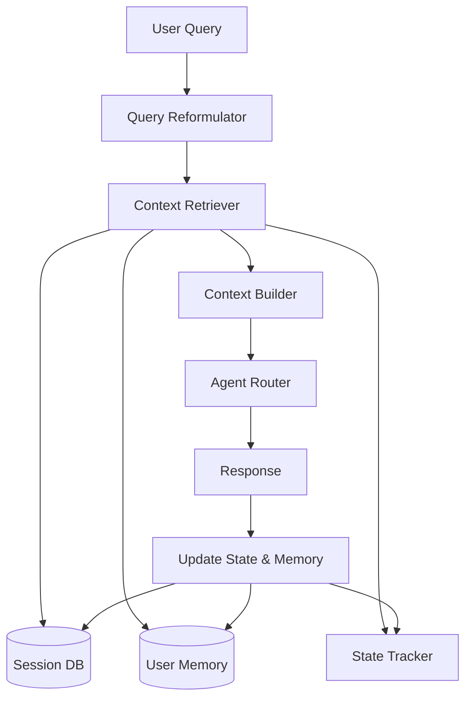

# Context Management Strategy: Scaling to ChatGPT-Level Conversations

**Goal:** Ensure context remains intact and intelligent across conversations of ANY length (10 turns, 100 turns, 1000 turns) without degradation.

---

## Current State Analysis

### What Works Well ✅
1. **Short conversations** (< 10 turns): Context is perfect
2. **Database persistence**: All messages stored in `ChatMessage` and `AiConversationEvent`
3. **Basic history retrieval**: Fetches last 20 messages from DB
4. **Summarization**: Condenses older messages when conversation gets long

### The Scalability Challenge 🎯
**Problem**: After ~15-20 turns, the system starts "forgetting" because:
- Only sends **8 messages** to LLM (hard limit)
- Summarization is **lossy** (important details get compressed away)
- No **semantic retrieval** (can't find relevant context from turn 5 when at turn 50)
- No **state persistence** (doesn't remember "user was in outfit builder mode 20 turns ago")

**The Goal**: Make it work like ChatGPT, where you can have a 100-turn conversation and the AI still remembers what you said in turn 3.

---

## The Core Problem: Token Limits vs. Memory Needs

```
Turn 1-10:   ✅ Full context fits in window
Turn 11-30:  ⚠️  Summarization starts, some detail lost
Turn 31-50:  ❌ Critical context from early conversation lost
Turn 51+:    ❌ AI has no memory of first half of conversation
```

**Why this matters**:
- User mentions their size preference in turn 3
- At turn 40, asks "show me something in my size"
- AI has forgotten → asks "what's your size?"

---

## Solution: Multi-Tier Memory Architecture

ChatGPT solves this with a **layered memory system**. For a shopping assistant, we add a critical **Product Context Layer**:

### Tier 0: Product Focus (Shopping-Specific) ⭐
**What**: Currently active product(s) with full details  
**Purpose**: Always know what user is looking at/discussing  
**Storage**: `ChatSession.metadata['product_focus']`  
**Lifespan**: Updates with each product interaction

**Product Focus Schema**:
```python
{
  "current_products": [
    {
      "product_id": "prod_123",
      "variant_id": "var_456",
      "name": "Nike Tech Fleece Hoodie",
      "price": 89.99,
      "size": "M",
      "color": "Black",
      "in_stock": true,
      "full_details": {...},  # Complete product data
      "user_interest_level": "high",  # based on dwell time, questions asked
      "turn_introduced": 5
    }
  ],
  "product_history": [
    {"product_id": "prod_789", "name": "Adidas Bomber", "turns": [1, 2, 3]},
    {"product_id": "prod_123", "name": "Nike Hoodie", "turns": [5, 6, 7, 8]}
  ],
  "last_search_results": ["prod_123", "prod_456", "prod_789"]  # IDs from last query
}
```

**Why this matters**:
- User asks "what's the material?" → AI knows which product they mean
- User says "show me more like this" → AI has full product details to match against
- User switches products → AI maintains history of what was discussed

### Tier 1: Working Memory (Immediate Context)
**What**: Last 8-10 messages, sent verbatim to LLM  
**Purpose**: Handle immediate back-and-forth  
**Storage**: In-memory cache  
**Lifespan**: Current conversation only

### Tier 2: Session Memory (Structured Facts)
**What**: Extracted facts and state from entire conversation  
**Purpose**: Remember key details without sending full history  
**Storage**: `ChatSession.metadata` + vector embeddings  
**Lifespan**: Entire session

**Examples of facts**:
- "User prefers size M"
- "User is looking for minimalist style"
- "User's budget is under €100"
- "Currently in outfit builder mode"

### Tier 3: Long-Term Memory (User Profile)
**What**: Persistent preferences across all sessions  
**Purpose**: Personalization that survives session end  
**Storage**: `AiUserProfile` table  
**Lifespan**: Forever (until user changes)

### Tier 4: Semantic Search (Historical Context)
**What**: Embedded conversation chunks, searchable by relevance  
**Purpose**: Retrieve specific context from 50 turns ago when needed  
**Storage**: Vector database  
**Lifespan**: Entire session (or longer)

---

## Proposed Architecture: "Contextual Brain"



### Core Principles

#### 1. **Query Reformulation**
**Problem**: Users speak in shorthand ("show more", "cheaper", "what about X?")  
**Solution**: Before processing, rewrite query as standalone question using conversation history

**How it works**:
- Take user's vague query + last N messages
- LLM call: "Rewrite this as a complete, standalone question"
- Use reformulated query for all downstream processing

**Generic Pattern**:
```
History: [User asked about X with filters Y]
User: "show me more"
Reformulated: "Show me more items matching [X with filters Y]"
```

#### 2. **State Tracking**
**Problem**: AI doesn't know what "mode" or "feature" user is currently using  
**Solution**: Track conversation state as metadata, update after each turn

**State Dimensions**:
- **Current Feature**: Which part of the system user is interacting with
- **Active Filters/Context**: What constraints are currently applied
- **User Intent**: What the user is trying to accomplish
- **Conversation Phase**: Beginning, middle, refinement, completion

**Storage**: `ChatSession.metadata['conversation_state']`

#### 3. **Adaptive Context Retrieval**
**Problem**: Can't send entire conversation history (token limits)  
**Solution**: Intelligently select what context to include

**Strategy** (Adaptive based on conversation length):
- **Short** (< 10 turns): Full verbatim history
- **Medium** (10-30 turns): Recent verbatim + summarized older
- **Long** (> 30 turns): Semantic retrieval (embed & search) + recent verbatim

**What to always include**:
1. User's persistent preferences/memory
2. Current conversation state
3. Last N messages (sliding window)
4. Relevant facts from earlier in conversation

#### 4. **Semantic Memory Extraction**
**Problem**: Important context gets lost in truncation  
**Solution**: Extract and store "facts" from conversation as structured data

**Process**:
1. After each turn, LLM extracts key facts
2. Store facts with embeddings for semantic search
3. When user asks new question, retrieve relevant facts

**Fact Types**:
- User preferences/constraints
- Items/entities being discussed
- Decisions made
- Questions asked/answered

**Storage**: Vector database or `meta['extracted_facts']` with embeddings

---

## Implementation: Preventing Context Degradation

### Phase 1: Fact Extraction + Product Focus (Week 1)
**Goal**: Don't lose important details AND always know which products user is focused on

**What to build**:
1. **Product Focus Tracker**: Track active products with full context
   ```python
   {
     "current_products": [
       {
         "product_id": "prod_123",
         "name": "Nike Hoodie",
         "full_details": {...},  # Complete product data from DB
         "user_questions": ["What's the material?", "Does it run small?"],
         "turn_introduced": 5,
         "last_mentioned": 8
       }
     ]
   }
   ```

2. **Conversation Facts**: Extract structured facts as before
   ```python
   {
     "user_preferences": {"size": "M", "style": "minimalist"},
     "active_filters": {"price_max": 100, "brand": "Nike"},
     "current_mode": "product_search"
   }
   ```

3. **Context Injection**: Always send to LLM:
   - Current product(s) with FULL details
   - Conversation facts
   - Recent messages

**Impact**: 
- AI always knows "this" refers to Nike Hoodie from turn 5
- AI has full product specs without re-fetching
- User can ask "what's the material?" and AI knows which product

---

### Phase 2: Increase Context Window (Week 1)
**Goal**: Send more verbatim history before resorting to summarization

**Changes**:
- Increase `MAX_HISTORY_MESSAGES` from 8 → **15**
- Increase `HISTORY_SUMMARY_THRESHOLD` from 16 → **30**
- This alone doubles the "perfect memory" range

**Impact**: Conversations stay crisp up to 30 turns instead of 15

---

### Phase 3: Semantic Retrieval (Week 2)
**Goal**: Find relevant context from anywhere in conversation

**What to build**:
1. Embed each message as it's created
2. When user asks new question:
   - Embed the question
   - Search conversation history for top-3 most relevant past messages
   - Include those in context (even if they're from turn 5 and we're at turn 50)

**Storage**: Use existing vector store or simple in-memory embeddings

**Impact**: AI can recall specific details from early conversation when relevant

---

### Phase 4: State Tracking (Week 2)
**Goal**: Remember what "mode" user is in across long conversations

**What to track**:
```python
{
  "current_feature": "outfit_builder",  # or "product_search", "cart", etc.
  "feature_history": [
    {"feature": "product_search", "turns": [1, 2, 3, 4]},
    {"feature": "outfit_builder", "turns": [5, 6, 7, 8, 9]}
  ]
}
```

**Impact**: When user switches back to product search at turn 50, AI knows the context from turns 1-4

---

## Example: Product Context in Action

### Scenario: User Exploring Products
```
Turn 1: "Show me Nike hoodies under €100"
[System stores]:
- Search results: [prod_123, prod_456, prod_789]
- Active filters: {brand: "Nike", type: "hoodie", price_max: 100}

Turn 2: User clicks on "Nike Tech Fleece Hoodie"
[System stores]:
- Current product: prod_123 with FULL details
- Product focus: "Nike Tech Fleece Hoodie"

Turn 5: "What's the material?"
[AI has context]:
- Current product: Nike Tech Fleece Hoodie
- Full specs: {material: "80% cotton, 20% polyester", ...}
✅ AI: "The Nike Tech Fleece Hoodie is 80% cotton, 20% polyester..."

Turn 10: "Show me something similar but cheaper"
[AI has context]:
- Reference product: Nike Tech Fleece Hoodie (€89.99)
- Full details to match against
✅ AI searches for: hoodies, similar style, price < €89.99

Turn 15: "What about the first one again?"
[AI has context]:
- Product history: [prod_789 (turn 1-3), prod_123 (turn 5-10)]
- "First one" = prod_789
✅ AI retrieves prod_789 details
```

**Key Difference**: System maintains **product-aware context**, not just message history.

---

## Key Metrics to Track
1. **Context Retention**: % of queries where agent remembers context from > 5 turns ago
2. **Reference Resolution**: % of vague queries ("show more", "cheaper") correctly resolved
3. **State Accuracy**: % of agent state transitions that are correct
4. **User Satisfaction**: Reduction in "I already told you that" complaints

---

## Next Steps
1. Review this strategy with team
2. Prioritize phases (suggest: Phase 1 + 2 first for quick wins)
3. Create detailed implementation plan for Phase 1
4. Set up A/B test to measure improvement
