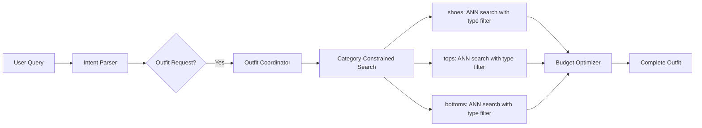

# Outfit Builder v2 - Architecture Redesign

## Problem Statement

The current outfit builder has fundamental architectural issues that cause cascading bugs requiring constant patching:

| Issue | Root Cause | Current Workaround |
|-------|------------|-------------------|
| Shoes not found | Vector search for "shoes" doesn't find "sneakers" | Keyword expansion hacks |
| Gender filter failures | Text filter on metadata field mismatch | Normalization maps |
| Category mismatches | Generic search + post-hoc filtering | Type expansion logic |

**Core Problem**: We're using text search + post-retrieval filtering instead of **category-aware embeddings**.

---

## Proposed Architecture



### Key Changes

1. **Move filtering to the database level** - Use PostgreSQL's vector search with `WHERE` clause
2. **Pre-normalize product categories** - Add `outfit_category` field at indexing time
3. **Remove LLM-based search planning** - Category structure is deterministic, not LLM-generated

---

## Proposed Changes

### Phase 1: Product Data Enrichment

#### [MODIFY] [product_loader.py](file:///Users/ssg/Desktop/COVE/cove-ai-core/scripts/product_loader.py)

Add `outfit_category` normalization during product ingestion:

```python
CATEGORY_MAPPING = {
    # Footwear -> "shoes"
    "sneakers": "shoes", "boots": "shoes", "loafers": "shoes", 
    "heels": "shoes", "sandals": "shoes",
    # Tops -> "tops"  
    "tee": "tops", "shirt": "tops", "blouse": "tops",
    "hoodie": "tops", "sweater": "tops", "sweatshirt": "tops",
    # Bottoms -> "bottoms"
    "pants": "bottoms", "jeans": "bottoms", "shorts": "bottoms",
    "joggers": "bottoms", "trousers": "bottoms", "skirt": "bottoms",
    # Outerwear -> "outerwear"
    "jacket": "outerwear", "blazer": "outerwear", "coat": "outerwear",
    # Default
    "accessories": "accessories"
}

def normalize_outfit_category(product_type: str) -> str:
    """Map specific product types to outfit categories."""
    return CATEGORY_MAPPING.get(product_type.lower(), "other")
```

Store `outfit_category` in product metadata during indexing.

---

#### [NEW] [migrate_outfit_categories.py](file:///Users/ssg/Desktop/COVE/cove-ai-core/scripts/migrate_outfit_categories.py)

Migration script to backfill `outfit_category` for existing products:

```python
# Pseudocode
for product in all_products:
    product.meta["outfit_category"] = normalize_outfit_category(product.meta.get("type", ""))
    update_product(product)
```

---

### Phase 2: Category-Constrained Vector Search

#### [MODIFY] [store.py](file:///Users/ssg/Desktop/COVE/cove-ai-core/app/vector/store.py)

Add new function for category-filtered ANN search:

```python
def search_by_category(
    conn: psycopg.Connection,
    query_embedding: List[float],
    outfit_category: str,  # "shoes", "tops", "bottoms"
    gender: Optional[str] = None,
    price_max: Optional[float] = None,
    top_k: int = 10
) -> List[Dict]:
    """
    Category-constrained Approximate Nearest Neighbor search.
    
    Filters are applied at the database level BEFORE vector distance calculation,
    ensuring we always get relevant results for the category.
    """
    sql = """
        SELECT id, title, url, meta, 
               1 - (emb <=> %s::vector) as similarity
        FROM ai_core.docs
        WHERE kind = 'product'
          AND meta->>'outfit_category' = %s
    """
    params = [query_embedding, outfit_category]
    
    if gender:
        sql += " AND (meta->>'gender' = %s OR meta->>'gender' = 'unisex')"
        params.append(gender)
    
    if price_max:
        sql += " AND (meta->>'price')::float <= %s"
        params.append(price_max)
    
    sql += " ORDER BY emb <=> %s::vector LIMIT %s"
    params.extend([query_embedding, top_k])
    
    # Execute and return results
    ...
```

> [!IMPORTANT]
> This is the key architectural change. By filtering at the SQL level, we guarantee results are in the correct category. Vector similarity is calculated only on matching products.

---

### Phase 3: Simplified Outfit Builder Agent

#### [MODIFY] [stylist_agent.py](file:///Users/ssg/Desktop/COVE/cove-ai-core/app/agents/stylist_agent.py)

**Remove:**
- `_expand_type_filter()` method
- Query keyword expansion logic
- Complex category_plans from LLM

**Replace with:**
```python
async def get_candidates_for_category(
    self,
    category: str,  # "shoes", "tops", "bottoms"
    style_query: str,
    gender: str,
    budget_per_category: float
) -> List[Dict]:
    """Simple category-constrained retrieval."""
    
    # 1. Get embedding for style context
    query_embedding = await embed_query(f"{style_query} {category}")
    
    # 2. Use category-constrained search (database-level filtering)
    with get_conn() as conn:
        candidates = search_by_category(
            conn=conn,
            query_embedding=query_embedding,
            outfit_category=category,
            gender=gender,
            price_max=budget_per_category,
            top_k=10
        )
    
    return candidates
```

---

#### [MODIFY] [outfit_builder_agent.py](file:///Users/ssg/Desktop/COVE/cove-ai-core/app/agents/outfit_builder_agent.py)

Simplify outfit assembly:

```python
async def execute(self, task, context, stream_callback=None):
    budget_max = task.get("budget_max", 500)
    gender = task.get("gender", "unisex")
    style = task.get("style", "casual")
    
    # Fixed category structure (no LLM planning needed)
    categories = ["tops", "bottoms", "shoes"]
    budget_per_category = budget_max / len(categories)
    
    all_outfits = []
    
    for outfit_idx in range(3):  # Generate 3 outfits
        outfit_items = []
        used_slugs = set()
        
        for category in categories:
            # Get candidates using category-constrained search
            candidates = await self.stylist.get_candidates_for_category(
                category=category,
                style_query=style,
                gender=gender,
                budget_per_category=budget_per_category
            )
            
            # Select best unused item
            for item in candidates:
                if item["slug"] not in used_slugs:
                    outfit_items.append({**item, "outfit_id": f"outfit_{outfit_idx+1}"})
                    used_slugs.add(item["slug"])
                    break
        
        all_outfits.extend(outfit_items)
    
    return AgentResult(success=True, data={"outfit_items": all_outfits})
```

---

## Verification Plan

### Automated Tests

#### 1. Unit Test: Category Normalization
**File**: `tests/test_category_normalization.py`
```bash
cd /Users/ssg/Desktop/COVE/cove-ai-core
python -m pytest tests/test_category_normalization.py -v
```

Tests:
- `sneakers` → `shoes`
- `hoodie` → `tops`  
- `jeans` → `bottoms`
- Unknown type → `other`

---

#### 2. Integration Test: Category-Constrained Search
**File**: `tests/test_category_search.py`
```bash
cd /Users/ssg/Desktop/COVE/cove-ai-core
python -m pytest tests/test_category_search.py -v
```

Tests:
- Search for "shoes" category returns ONLY sneakers/boots/etc
- Search for "tops" category never returns pants
- Gender filter works (men's query → no women's items)

---

#### 3. End-to-End Test: Outfit Generation
**File**: `verify_outfits.py` (existing, will be updated)
```bash
cd /Users/ssg/Desktop/COVE/cove-ai-core
python3 verify_outfits.py
```

Expected output:
```
--- outfit_1 (3 items) ---
Total Cost: €XXX.XX (under €500)
  * Urban Runner Sneakers (€XX.XX)    ← shoes category
  * LuxeLine Tee (€XX.XX)             ← tops category
  * TimelessCo Pants (€XX.XX)         ← bottoms category
```

**Success criteria:**
- 3 outfits generated
- Each outfit has exactly 3 items (tops, bottoms, shoes)
- NO "Missing X" items
- Each outfit total < €500

---

### Manual Verification

#### Browser Test (UI)
1. Open http://localhost:3000
2. Click the chat widget
3. Type: "I want a casual outfit for men under 500 euros"
4. Confirm the outfit modal shows 3 complete outfits with actual products

---

## Migration Strategy

1. **Phase 1 first** - Run migration script to add `outfit_category` to all products
2. **Phase 2** - Add new search function (backward compatible)
3. **Phase 3** - Update agents to use new search (can coexist with old code)
4. **Cleanup** - Remove old keyword expansion and type mapping hacks

---

## Design Decisions (Finalized)

### 1. Categories
- **Core outfit**: Tops + Bottoms + Shoes (always included)
- **Accessories**: Optional - show if budget remaining OR ask user after viewing outfit

### 2. Budget Allocation
Based on fashion industry best practices (60% foundational, 30% seasonal):

| Category | Allocation | Rationale |
|----------|------------|-----------|
| **Shoes** | 35% | Foundational, high impact piece |
| **Bottoms** | 35% | Foundational, worn frequently |
| **Tops** | 30% | More variety, lower cost per wear |

For €500 budget:
- Shoes: €175
- Bottoms: €175
- Tops: €150

### 3. Fallback Behavior
If no items found for a category under allocated budget:
1. Skip the category with a note
2. Ask user: "We couldn't find [shoes] under €X. Would you like to increase your budget or skip this category?"

---

## User Approval

> [!IMPORTANT]
> Awaiting user approval to proceed with implementation.
