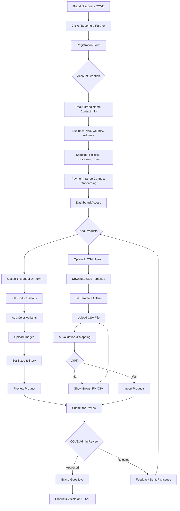
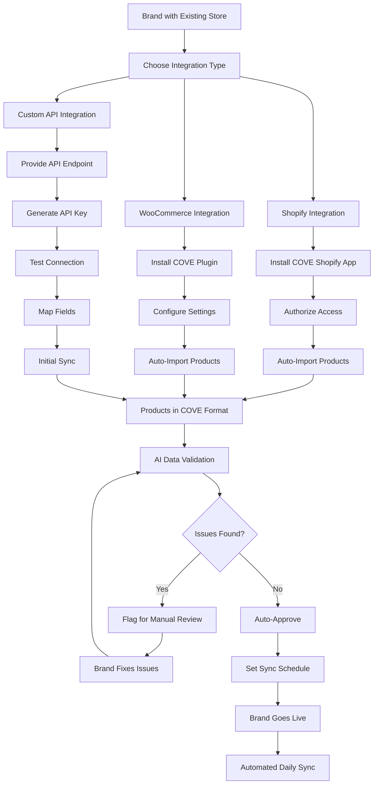
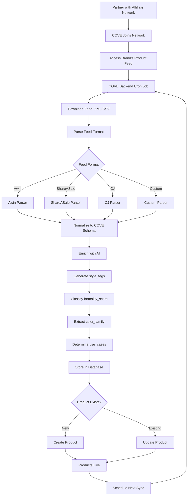
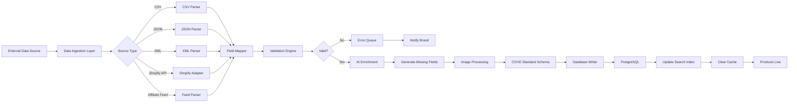

# COVE Brand Onboarding Architecture & Schema

> **Purpose**: Define the complete automated brand onboarding system for COVE Platform  
> **Scope**: Affiliate brands, Direct brands, Data standardization, Backend schema, Frontend flows  
> **Status**: Architecture Approved - Ready for Implementation

---

## 📋 Table of Contents

1. [COVE Vision Recap](#cove-vision-recap)
2. [Brand Types & Data Sharing Methods](#brand-types--data-sharing-methods)
3. [Core Data Schema](#core-data-schema)
4. [Brand Onboarding Flows](#brand-onboarding-flows)
5. [Data Ingestion & Normalization Pipeline](#data-ingestion--normalization-pipeline)
6. [Backend Architecture](#backend-architecture)
7. [Frontend UI/UX Flow](#frontend-uiux-flow)
8. [Technical Decisions (APPROVED)](#technical-decisions-approved)
9. [Implementation Roadmap](#implementation-roadmap)

---

## 🎯 COVE Vision Recap

Based on the comprehensive vision document, COVE is:

### Core Identity
- **Europe's AI-Driven Fashion Marketplace** connecting buyers with fashion brands
- **Dual-sided platform**: Consumer shopping experience + Brand management tools
- **AI-First Approach**: Every feature powered by COVE AI (Bubbles chatbot, XMail, XVoice)

### Business Model
- **Commission-based** marketplace (like Zalando, ASOS)
- **Free platform access** for brands to list products
- **Premium services** (XMail €49-99/mo, XVoice +€49/mo) for automation
- **Low barrier to entry** to attract diverse brand portfolio

### Target Brands
1. **Small/Solo Founders**: Independent designers, boutique brands
2. **Medium Brands**: Growing fashion companies
3. **Affiliate Programs**: Partnership with established brands via affiliate networks
4. **International Brands**: EU-based and global brands selling in EU

---

## 🏢 Brand Types & Data Sharing Methods

### Type 1: Direct Brands (Own Inventory)

These brands **actually sell and ship** their products. COVE takes a commission.

#### Subcategories:

**A. Small Solo Founders**
- **Data Source**: Manual input via COVE dashboard
- **Tech Savviness**: Low to medium
- **Expected Format**: UI forms, CSV upload
- **Volume**: 10-100 products initially
- **Example**: Independent designer with own clothing line

**B. Established E-commerce Brands**
- **Data Source**: API integration, automated feeds
- **Tech Savviness**: High
- **Expected Format**: JSON API, XML feeds, Shopify/WooCommerce export
- **Volume**: 100-10,000+ products
- **Example**: Brand with existing Shopify store

---

### Type 2: Affiliate Brands (Third-Party Inventory)

These brands don't ship from COVE. When a customer buys, COVE redirects to the brand's site and earns affiliate commission.

#### Data Sources:

**A. Affiliate Networks**
- **Networks**: Awin, CJ Affiliate, ShareASale, Rakuten, TradeDoubler (EU-focused)
- **Data Format**: Product feeds (XML, CSV), API access
- **Update Frequency**: Daily automated sync
- **Challenge**: Standardizing across different network formats

**B. Direct Affiliate Partnerships**
- **Examples**: Nike, Adidas, Zara (if they offer affiliate programs)
- **Data Format**: Custom API, product feeds
- **Relationship**: Direct contract with brand

---

### 📊 Data Sharing Methods Summary

| Brand Type | Data Method | Format | Frequency | Human Touch Needed |
|------------|-------------|---------|-----------|-------------------|
| **Small Solo** | Manual UI | Web forms | On-demand | High |
| **Small Solo** | Bulk Upload | CSV/JSON | Weekly | Medium |
| **Established** | API Integration | JSON REST/GraphQL | Real-time | Low |
| **Established** | Platform Export | Shopify/WooCommerce | Daily sync | Medium |
| **Affiliate Network** | Feed Sync | XML/CSV | Daily automated | None |
| **Direct Affiliate** | API/Feed | Custom | Hourly/Daily | Low |

---

## 🗄️ Core Data Schema

### Current State Analysis

Looking at your existing `backend/catalog/models.py`:

```python
class Brand(models.Model):
    brand_id = models.CharField(max_length=50, primary_key=True)
    brand_name = models.CharField(max_length=100)
    slug = models.SlugField(max_length=100, unique=True, db_index=True)
    logo_url = models.CharField(max_length=500, blank=True, null=True)
    theme_colors = models.JSONField(blank=True, null=True)
    is_active = models.BooleanField(default=True)
    created_at = models.DateTimeField(auto_now_add=True)
    description = models.TextField(blank=True, null=True)
```

### ⚠️ What's Missing for Complete Brand Onboarding:

```python
# ENHANCED Brand Model
class Brand(models.Model):
    # ===== EXISTING FIELDS =====
    brand_id = models.CharField(max_length=50, primary_key=True)
    brand_name = models.CharField(max_length=100)
    slug = models.SlugField(max_length=100, unique=True, db_index=True)
    logo_url = models.CharField(max_length=500, blank=True, null=True)
    theme_colors = models.JSONField(blank=True, null=True)
    is_active = models.BooleanField(default=True)
    created_at = models.DateTimeField(auto_now_add=True)
    description = models.TextField(blank=True, null=True)
    
    # ===== NEW: BRAND TYPE & INTEGRATION =====
    brand_type = models.CharField(
        max_length=20, 
        choices=[
            ('direct', 'Direct Seller'),      # Ships from own inventory
            ('affiliate', 'Affiliate'),        # Redirects to external site
        ],
        default='direct'
    )
    
    integration_method = models.CharField(
        max_length=20,
        choices=[
            ('manual', 'Manual Entry'),
            ('csv', 'CSV Upload'),
            ('api', 'API Integration'),
            ('shopify', 'Shopify Sync'),
            ('woocommerce', 'WooCommerce Sync'),
            ('affiliate_feed', 'Affiliate Feed'),
        ],
        default='manual'
    )
    
    # ===== NEW: AFFILIATE TRACKING =====
    affiliate_network = models.CharField(
        max_length=50, blank=True, null=True,
        help_text="Awin, CJ, ShareASale, etc."
    )
    affiliate_program_id = models.CharField(
        max_length=100, blank=True, null=True
    )
    affiliate_commission_rate = models.DecimalField(
        max_digits=5, decimal_places=2, blank=True, null=True,
        help_text="Percentage commission (e.g., 10.5 for 10.5%)"
    )
    
    # ===== NEW: DATA SYNC =====
    feed_url = models.URLField(blank=True, null=True, help_text="Product feed URL")
    api_endpoint = models.URLField(blank=True, null=True)
    api_key_encrypted = models.CharField(max_length=500, blank=True, null=True)
    last_sync_at = models.DateTimeField(blank=True, null=True)
    sync_frequency = models.CharField(
        max_length=20,
        choices=[
            ('manual', 'Manual Only'),
            ('hourly', 'Every Hour'),
            ('daily', 'Daily'),
            ('weekly', 'Weekly'),
        ],
        default='manual'
    )
    sync_status = models.CharField(
        max_length=20,
        choices=[
            ('never', 'Never Synced'),
            ('success', 'Success'),
            ('pending', 'In Progress'),
            ('failed', 'Failed'),
        ],
        default='never'
    )
    sync_error_log = models.TextField(blank=True, null=True)
    
    # ===== NEW: BUSINESS INFO =====
    contact_name = models.CharField(max_length=100, blank=True, null=True)
    contact_email = models.EmailField()
    contact_phone = models.CharField(max_length=20, blank=True, null=True)
    company_registration = models.CharField(
        max_length=100, blank=True, null=True,
        help_text="VAT/Business registration number"
    )
    country = models.CharField(max_length=2, help_text="ISO country code (DE, FR, etc.)")
    
    # ===== NEW: ONBOARDING STATUS =====
    onboarding_status = models.CharField(
        max_length=20,
        choices=[
            ('pending', 'Application Pending'),
            ('info_complete', 'Info Submitted'),
            ('products_added', 'Products Added'),
            ('live', 'Live on Platform'),
            ('suspended', 'Suspended'),
        ],
        default='pending'
    )
    onboarding_completed_at = models.DateTimeField(blank=True, null=True)
    
    # ===== NEW: PAYMENT INFO =====
    stripe_account_id = models.CharField(
        max_length=255, blank=True, null=True,
        help_text="Stripe Connect account for payouts"
    )
    payment_method_verified = models.BooleanField(default=False)
    
    # ===== NEW: SHIPPING SETTINGS =====
    ships_from_country = models.CharField(max_length=2, blank=True, null=True)
    shipping_policy = models.TextField(blank=True, null=True)
    return_policy = models.TextField(blank=True, null=True)
    processing_days = models.IntegerField(
        default=3,
        help_text="Days to process and ship order"
    )
```

### Product Data Standardization Schema

Different sources provide product data in different formats. We need a **universal ingestion schema** that maps all formats to COVE's internal structure.

#### COVE Standard Product Schema (Target)

```json
{
  "brand_id": "BRAND123",
  "product_id": "BRAND123-PROD001",
  "name": "Classic Cotton T-Shirt",
  "slug": "classic-cotton-t-shirt",
  "description": "Comfortable everyday t-shirt...",
  "category": "tops",
  "type": "t-shirt",
  "gender": "unisex",
  "material": "100% Cotton",
  "fit": "regular",
  "tier": "basic",
  "base_price": 19.99,
  
  // Enhanced fields
  "style_tags": ["casual", "minimalist"],
  "pattern": "solid",
  "season": ["spring", "summer", "fall"],
  "use_cases": ["casual", "everyday"],
  "formality_score": 3,
  "versatility": 8,
  "statement_piece": false,
  "color_family": "neutral",
  
  // Color variants
  "variants": [
    {
      "variant_id": "BRAND123-PROD001-BLK",
      "color_name": "Black",
      "hex": "#000000",
      "images": [
        "https://cdn.example.com/img1.jpg",
        "https://cdn.example.com/img2.jpg"
      ],
      "sizes": [
        {"size": "S", "quantity": 50, "price": 19.99},
        {"size": "M", "quantity": 100, "price": 19.99},
        {"size": "L", "quantity": 75, "price": 19.99},
        {"size": "XL", "quantity": 30, "price": 19.99}
      ]
    },
    {
      "variant_id": "BRAND123-PROD001-WHT",
      "color_name": "White",
      "hex": "#FFFFFF",
      "images": ["https://cdn.example.com/img3.jpg"],
      "sizes": [
        {"size": "S", "quantity": 40, "price": 19.99},
        {"size": "M", "quantity": 80, "price": 19.99}
      ]
    }
  ],
  
  // Affiliate-specific
  "affiliate_url": "https://partner.com/product/123?aff=cove",  // Only if affiliate
  "external_product_id": "PARTNER-SKU-789"  // Original ID from source
}
```

---

## 🔄 Brand Onboarding Flows

### Flow 1: Small Solo Founder (Manual Onboarding)



#### CSV Template Structure

```csv
product_name,description,category,type,gender,material,fit,base_price,color_name,hex,image_urls,sizes_stock
"Classic T-Shirt","Comfortable cotton tee","tops","t-shirt","unisex","100% Cotton","regular",19.99,"Black","#000000","https://img1.jpg|https://img2.jpg","S:50:19.99|M:100:19.99|L:75:19.99|XL:30:19.99"
"Classic T-Shirt","Comfortable cotton tee","tops","t-shirt","unisex","100% Cotton","regular",19.99,"White","#FFFFFF","https://img3.jpg","S:40:19.99|M:80:19.99"
```

---

### Flow 2: Established Brand (API/Platform Integration)



---

### Flow 3: Affiliate Brand (Feed Integration)



---

## 🔧 Data Ingestion & Normalization Pipeline

### Pipeline Architecture



### Field Mapping Examples

#### Example 1: Shopify to COVE

| Shopify Field | COVE Field | Transformation |
|---------------|------------|----------------|
| `title` | `name` | Direct mapping |
| `body_html` | `description` | Strip HTML tags |
| `product_type` | `type` | Lowercase, slugify |
| `vendor` | `brand_name` | Direct mapping |
| `tags` | `style_tags` | Split by comma, clean |
| `variants[].option1` | `color_name` | If option name is "Color" |
| `variants[].option2` | `size` | If option name is "Size" |
| `variants[].price` | `price` | Convert to Decimal |
| `variants[].inventory_quantity` | `quantity` | Direct mapping |
| `images[].src` | `images` | Download & rehost or link |

#### Example 2: Awin Affiliate Feed to COVE

| Awin Field | COVE Field | Transformation |
|------------|------------|----------------|
| `product_name` | `name` | Direct |
| `description` | `description` | Clean HTML |
| `merchant_product_id` | `external_product_id` | Store original ID |
| `merchant_category` | `type` | AI categorization |
| `search_price` | `base_price` | Convert currency if needed |
| `merchant_deep_link` | `affiliate_url` | Add tracking params |
| `merchant_image_url` | `images` | Validate & store |
| `colour` | `color_name` | Standardize spelling |
| `size` | Size creation | Parse size string |

### AI Enrichment Module

Some fields might be missing from external sources. Use AI to intelligently fill them:

```python
def enrich_product_with_ai(product_data):
    """
    Use COVE AI to generate missing fields
    """
    # Example: Generate style_tags from name + description
    if not product_data.get('style_tags'):
        prompt = f"""
        Product: {product_data['name']}
        Description: {product_data['description']}
        
        Generate 2-4 style tags from: minimalist, streetwear, vintage, 
        formal, casual, sporty, bohemian, preppy, edgy, classic
        """
        product_data['style_tags'] = ai_model.generate(prompt)
    
    # Determine formality_score (1-10)
    if not product_data.get('formality_score'):
        product_data['formality_score'] = ai_model.classify_formality(
            product_data['name'], 
            product_data['type']
        )
    
    # Extract color_family from color_name or images
    if not product_data.get('color_family'):
        product_data['color_family'] = ai_model.classify_color_family(
            product_data.get('color_name'),
            product_data.get('images', [])
        )
    
    return product_data
```

---

## 🏗️ Backend Architecture

### Directory Structure

```
backend/
├── brands/                      # NEW: Brand management app
│   ├── models.py                # Enhanced Brand model
│   ├── serializers.py           # Brand API serializers
│   ├── views.py                 # Brand dashboard views
│   ├── onboarding_views.py      # Onboarding flow endpoints
│   ├── sync_manager.py          # Product sync orchestration
│   └── parsers/                 # Data parsers
│       ├── base.py              # Abstract parser
│       ├── csv_parser.py
│       ├── shopify_parser.py
│       ├── woocommerce_parser.py
│       ├── awin_parser.py
│       ├── sharesale_parser.py
│       └── cj_parser.py
│
├── catalog/                     # Existing product catalog
│   ├── models.py                # Product models (already exists)
│   └── ...
│
├── data_ingestion/              # NEW: Data pipeline app
│   ├── field_mapper.py          # Map external → COVE fields
│   ├── validator.py             # Validate product data
│   ├── enrichment.py            # AI enrichment logic
│   ├── image_processor.py       # Download, resize, optimize images
│   └── sync_scheduler.py        # Celery tasks for periodic sync
│
└── utils/
    └── ai_helpers.py            # AI utility functions
```

### Key Backend Endpoints

```python
# Brand Onboarding Endpoints
POST   /api/brands/register/              # Step 1: Create brand account
PATCH  /api/brands/{id}/business-info/    # Step 2: Business details
PATCH  /api/brands/{id}/shipping/         # Step 3: Shipping settings
POST   /api/brands/{id}/stripe-connect/   # Step 4: Payment setup
GET    /api/brands/{id}/dashboard/        # Brand dashboard data

# Product Management
POST   /api/brands/{id}/products/         # Manual product entry
POST   /api/brands/{id}/products/csv/     # CSV upload
POST   /api/brands/{id}/products/sync/    # Trigger manual sync
GET    /api/brands/{id}/products/         # List brand's products
DELETE /api/brands/{id}/products/{pid}/   # Delete product

# Integration Setup
POST   /api/brands/{id}/integration/shopify/      # Shopify auth
POST   /api/brands/{id}/integration/api/          # Custom API setup
POST   /api/brands/{id}/integration/feed/         # Affiliate feed URL
GET    /api/brands/{id}/integration/sync-status/  # Check sync status

# Admin Endpoints
GET    /api/admin/brands/pending/         # Brands awaiting approval
PATCH  /api/admin/brands/{id}/approve/    # Approve brand
PATCH  /api/admin/brands/{id}/reject/     # Reject with reason
```

---

## 🎨 Frontend UI/UX Flow

### Brand Partner Portal

```
frontend/src/app/
├── partner/                     # NEW: Brand partner section
│   ├── register/
│   │   ├── page.tsx             # Multi-step registration wizard
│   │   └── components/
│   │       ├── StepIndicator.tsx
│   │       ├── BusinessInfoForm.tsx
│   │       ├── ShippingForm.tsx
│   │       └── PaymentSetup.tsx
│   │
│   ├── dashboard/
│   │   ├── page.tsx             # Brand dashboard home
│   │   └── components/
│   │       ├── StatsOverview.tsx      # Sales, views, revenue
│   │       ├── RecentOrders.tsx
│   │       └── QuickActions.tsx
│   │
│   ├── products/
│   │   ├── page.tsx             # Product management page
│   │   ├── add/
│   │   │   ├── page.tsx         # Add product wizard
│   │   │   └── components/
│   │   │       ├── ProductInfoStep.tsx
│   │   │       ├── VariantsStep.tsx
│   │   │       ├── ImagesStep.tsx
│   │   │       └── PreviewStep.tsx
│   │   ├── bulk/
│   │   │   ├── page.tsx         # CSV upload interface
│   │   │   └── components/
│   │   │       ├── CSVUploader.tsx
│   │   │       ├── TemplateDownload.tsx
│   │   │       └── ValidationResults.tsx
│   │   └── [id]/
│   │       └── edit/
│   │           └── page.tsx     # Edit existing product
│   │
│   ├── integration/
│   │   ├── page.tsx             # Integration hub
│   │   └── components/
│   │       ├── ShopifyConnect.tsx
│   │       ├── APISetup.tsx
│   │       ├── FeedConfig.tsx
│   │       └── SyncStatus.tsx
│   │
│   └── settings/
│       └── page.tsx             # Brand settings
│
└── (existing shopping pages...)
```

### Key UI Components

#### 1. Multi-Step Registration Wizard

```tsx
// partner/register/page.tsx
export default function BrandRegistration() {
  const [currentStep, setCurrentStep] = useState(1);
  const totalSteps = 4;
  
  return (
    <div className="min-h-screen bg-gradient-to-br from-gray-50 to-gray-100">
      <StepIndicator current={currentStep} total={totalSteps} />
      
      {currentStep === 1 && <BusinessInfoForm onNext={...} />}
      {currentStep === 2 && <ShippingForm onNext={...} />}
      {currentStep === 3 && <PaymentSetup onNext={...} />}
      {currentStep === 4 && <IntegrationChoice onComplete={...} />}
    </div>
  );
}
```

#### 2. CSV Bulk Upload with Validation

```tsx
// partner/products/bulk/components/CSVUploader.tsx
export function CSVUploader() {
  const [file, setFile] = useState<File | null>(null);
  const [validationResults, setValidationResults] = useState(null);
  
  const handleUpload = async () => {
    const formData = new FormData();
    formData.append('csv', file);
    
    const response = await fetch('/api/brands/products/csv/', {
      method: 'POST',
      body: formData,
    });
    
    const results = await response.json();
    setValidationResults(results);
  };
  
  return (
    <div>
      <TemplateDownload />
      <FileDropzone onFileSelect={setFile} />
      {validationResults && <ValidationResults data={validationResults} />}
      <Button onClick={handleUpload}>Upload & Validate</Button>
    </div>
  );
}
```

#### 3. Integration Status Dashboard

```tsx
// partner/integration/components/SyncStatus.tsx
export function SyncStatus({ brandId }) {
  const { data: status } = useSWR(`/api/brands/${brandId}/integration/sync-status/`);
  
  return (
    <Card>
      <h3>Sync Status</h3>
      <div className="flex items-center gap-4">
        <StatusBadge status={status.sync_status} />
        <div>
          <p>Last Sync: {formatDate(status.last_sync_at)}</p>
          <p>Next Sync: {formatDate(status.next_sync_at)}</p>
          <p>Products Synced: {status.products_count}</p>
        </div>
      </div>
      {status.sync_error_log && (
        <Alert variant="error">
          <p>Last Error: {status.sync_error_log}</p>
        </Alert>
      )}
      <Button onClick={triggerManualSync}>Sync Now</Button>
    </Card>
  );
}
```

---

## ✅ Technical Decisions (APPROVED)

The following technical decisions have been made and approved for implementation:

### 1. Image Storage Strategy
**Decision: Hybrid Approach**

- **For Affiliate Brands**: Link to external image URLs
  - *Rationale*: No storage costs, brands manage their own images
  - *Fallback*: If external URL fails 3 times, cache locally
  
- **For Direct Brands**: Rehost images on COVE CDN
  - *Rationale*: Better control, consistent loading speeds, brand independence
  - *Implementation*: During product upload, download → optimize → upload to CDN
  - *CDN Choice*: Cloudflare Images or AWS CloudFront

**Benefits**: Cost-effective for affiliates, reliable for direct brands

---

### 2. Data Validation Strictness
**Decision: Lenient with AI Auto-Fill**

- **Required Core Fields** (Must have):
  - `name`, `description`, `base_price`, `at least 1 image`, `at least 1 size`
  
- **Optional but Recommended Fields**:
  - `style_tags`, `formality_score`, `color_family`, `use_cases`, `season`
  
- **Auto-Fill Strategy**:
  - If optional fields missing → AI generates them automatically
  - Brand can edit AI-generated values later
  - Low-quality AI generations flagged for manual review

**Benefits**: Lower onboarding friction, maintain catalog quality via AI

---

### 3. Affiliate Product Updates
**Decision: Automated with Smart Rules**

**Price Changes**:
- Auto-update immediately (no notification)
- Log all price changes for brand transparency

**Stock Changes**:
- If out of stock → Mark as "Currently Unavailable" (keep visible)
- If unavailable for 30+ days → Auto-hide from search (keep in database)
- When back in stock → Auto-restore visibility

**Product Deletions**:
- If product removed from feed → Mark as "Discontinued"
- Keep in database for order history
- Remove from active catalog immediately

**Benefits**: Fresh catalog data, no stale listings, minimal manual work

---

### 4. Onboarding Approval Process
**Decision: Smart Auto-Approval with Thresholds**

**Auto-Approve**:
- API integrations (Shopify, WooCommerce) → Instant approval
- Direct brands with valid VAT/business registration → Auto-approve
- Affiliate network brands → Auto-approve (COVE curates at network level)

**Manual Review Required**:
- First-time sellers with <3 products → Review within 24 hours
- Brands flagged by AI quality check (e.g., duplicate images, spammy descriptions)
- Brands from high-risk countries (based on fraud data)

**Review SLA**: 
- Standard: 24 hours
- Priority (paid): 4 hours

**Benefits**: Fast onboarding for legitimate brands, quality control for edge cases

---

### 5. Field Mapping Customization
**Decision: Smart Defaults with Advanced Override**

**Default Experience** (90% of brands):
- COVE provides intelligent auto-mapping based on common formats
- Example: "product_title" → "name", "product_description" → "description"
- No configuration needed

**Advanced Override** (Power users):
- Brands can access "Advanced Mapping" screen
- Drag-and-drop field mapper UI
- Save custom mapping templates
- Use cases: Brands with unusual feed formats

**Implementation**:
```python
# Default mapping
SHOPIFY_MAPPING = {
    'title': 'name',
    'body_html': 'description',
    # ... standard mappings
}

# Brand can override
brand.custom_field_mapping = {
    'my_custom_field_name': 'formality_score'
}
```

**Benefits**: Simple for most, flexible for edge cases

---

## 🚀 Implementation Roadmap

### Phase 1: Foundation (Weeks 1-2) ✅ PRIORITY
- [ ] Enhance `Brand` model with new fields (see schema above)
- [ ] Create database migrations
- [ ] Build base parser classes (`BaseFeedParser`, `BaseAPIAdapter`)
- [ ] Set up CDN infrastructure for image hosting
- [ ] Design frontend wireframes (partner portal)

**Deliverables**: Updated database schema, parser foundation

---

### Phase 2: Manual Onboarding (Weeks 3-4) ✅ PRIORITY
- [ ] Build registration wizard (4-step UI flow)
- [ ] Implement manual product entry form
- [ ] CSV upload endpoint with validation
- [ ] CSV template download feature
- [ ] Brand dashboard (basic stats view)
- [ ] Admin approval workflow interface
- [ ] Email notifications (approval, rejection, welcome)

**Deliverables**: Fully functional manual onboarding flow, first brand can join

---

### Phase 3: API Integrations (Weeks 5-7)
- [ ] Shopify OAuth integration
- [ ] Shopify webhook handlers (product create/update/delete)
- [ ] WooCommerce REST API integration
- [ ] WooCommerce plugin development (if needed)
- [ ] Custom API adapter (generic JSON/REST)
- [ ] Automated sync scheduler (Celery + Redis)
- [ ] Error handling & retry logic
- [ ] Sync status dashboard

**Deliverables**: Shopify and WooCommerce integrations live

---

### Phase 4: Affiliate Integration (Weeks 8-10)
- [ ] Awin feed parser (XML format)
- [ ] ShareASale feed parser (CSV format)
- [ ] CJ Affiliate feed parser (XML format)
- [ ] AI enrichment module (connect to COVE AI)
- [ ] Automated daily sync cron jobs
- [ ] Affiliate link tracking (UTM parameters)
- [ ] Commission calculation logic

**Deliverables**: First affiliate network integrated, products auto-syncing

---

### Phase 5: Polish & Launch (Weeks 11-12)
- [ ] End-to-end testing (all onboarding flows)
- [ ] Performance optimization (database indexes, caching)
- [ ] Security audit (API keys encryption, input validation)
- [ ] Brand documentation portal
- [ ] Video tutorials (how to onboard)
- [ ] Launch partner portal publicly
- [ ] Onboard first 10 pilot brands
- [ ] Collect feedback & iterate

**Deliverables**: Production-ready partner onboarding system

---

## 📊 Success Metrics

Track these KPIs to measure onboarding system effectiveness:

| Metric | Target | Measurement |
|--------|--------|-------------|
| **Onboarding Completion Rate** | >80% | % of brands who complete all steps |
| **Time to First Product** | <15 mins | Median time from signup to first product live |
| **CSV Upload Success Rate** | >90% | % of CSV uploads that validate on first try |
| **API Sync Reliability** | 99.5% | % of scheduled syncs that complete successfully |
| **Manual Review Time** | <24 hours | Median time for admin to review pending brands |
| **Brand Satisfaction (NPS)** | >50 | Post-onboarding survey score |

---

## 📝 Summary

This architecture provides:

✅ **Flexible onboarding** for all brand types (solo founders to enterprises)  
✅ **Automated data normalization** across diverse sources  
✅ **AI-powered quality control** to maintain catalog standards  
✅ **Scalable infrastructure** from 10 to 10,000 brands  
✅ **Clear implementation roadmap** with phased approach  

**Next Steps**: Begin Phase 1 implementation (database schema enhancement).

---

*Document Version: 2.0*  
*Last Updated: January 2026*  
*Status: Approved for Implementation*
