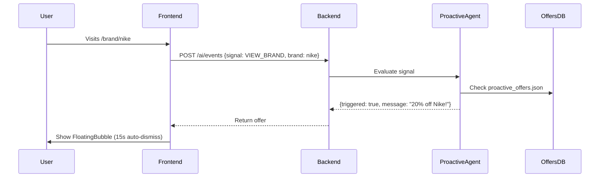

# Phase 3: Proactive Agent - Implementation Status

**Branch:** `feature/proactive-agent`  
**Status:** ✅ Implemented (Not Yet Tested)  
**Date:** 2025-12-23

---

## What Was Built

### 1. Backend Infrastructure
- **`app/agents/proactive_agent.py`**: Core agent that evaluates signals against rules
- **`app/routes/events.py`**: New endpoint `POST /ai/events` for receiving frontend signals
- **`data/proactive_offers.json`**: Config-driven offer rules (Nike, Gucci, Free Shipping)

### 2. Frontend Components
- **`hooks/useProactiveSignals.ts`**: Monitors user navigation and sends signals to backend
- **`components/ProactiveBubble.tsx`**: Floating notification UI (non-intrusive)
- **`FloatingChatbot.tsx`**: Integrated bubble with auto-dismiss logic

### 3. Signal Types Implemented
- `VIEW_BRAND`: Triggers when user visits brand pages (e.g., `/brand/nike`)
- `VIEW_PRODUCT`: Triggers on product page dwell time
- `CART_UPDATE`: Triggers based on cart value thresholds

---

## How It Works

---

## Example Offers Configured

| Trigger | Condition | Message |
|---------|-----------|---------|
| `VIEW_BRAND` (Nike) | 2+ visits | "👋 Big fan of Nike? We have a hidden 20% discount: **NIKE20**" |
| `VIEW_PRODUCT` (Gucci) | 15s+ dwell | "That's a timeless piece. ✨ Free express insurance on all Gucci orders." |
| `CART_UPDATE` | €80-€100 | "🚚 You're just **€X** away from free shipping!" |

---

## Known Issues Fixed
1. ❌ `ModuleNotFoundError: app.core.logger` → ✅ Fixed (use standard `logging`)
2. ❌ `TypeError: Cannot read 'cart.total'` → ✅ Fixed (calculate from `items`)

---

## Testing Checklist (Not Yet Done)
- [ ] Visit `/brand/nike` twice → Bubble should appear
- [ ] Add items to cart (€90 total) → Free shipping nudge
- [ ] Click bubble → Opens chat
- [ ] Ignore bubble → Auto-dismisses after 15s
- [ ] Verify backend logs show signal processing

---

## Next Steps (When Resuming)
1. **Manual Testing**: Verify end-to-end flow in browser
2. **Data Enrichment**: Add more brand offers to `proactive_offers.json`
3. **Analytics**: Track bubble click-through rates
4. **Polish**: Add sound effects or animations to bubble entrance

---

## Files Modified
- `cove-ai-core/app/agents/proactive_agent.py` (NEW)
- `cove-ai-core/app/routes/events.py` (NEW)
- `cove-ai-core/app/main.py` (added router)
- `cove-ai-core/data/proactive_offers.json` (NEW)
- `frontend/src/hooks/useProactiveSignals.ts` (NEW)
- `frontend/src/components/cove-ai/ProactiveBubble.tsx` (NEW)
- `frontend/src/components/cove-ai/FloatingChatbot.tsx` (integrated)
