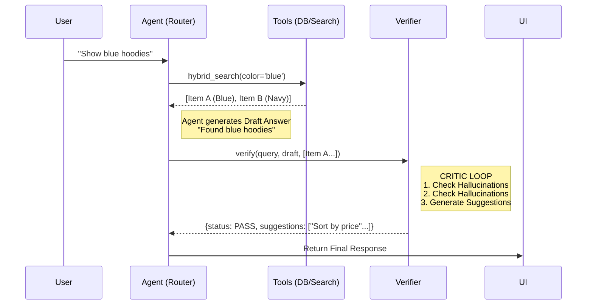

# System Flow & Verifier Integration

This specific map details exactly how data flows from the User to the Tools, then to the Verifier, and finally back to the User.

## 1. Product Search Flow ("Show me blue hoodies")

1.  **User Query**: "Show me blue hoodies"
2.  **Intent Classifier**: detects `recommendations`. Extracts `filters: {color: blue, type: hoodie}`.
3.  **Agent Logic** (`agent.py`):
    *   Calls `hybrid_search(filters)` **(The Tool)**.
    *   **Tool Output**: `[Item(id=1, name="Navy Hoodie", color="Navy"), Item(id=2, name="Sky Blue", color="Blue")]`. count=2.
    *   **Draft Answer**: "I found these great blue hoodies for you."
4.  **Verifier Input** (The "Data Feed"):
    *   `query`: "Show me blue hoodies"
    *   `draft`: "I found these great blue hoodies for you."
    *   `tool_outputs`: `{ "items_found": 2, "top_item": {"name": "Navy Hoodie", "color": "Navy"} }` (The Truth).
5.  **Verifier Logic**:
    *   Checks: User said "Blue". Tool found "Navy" (close enough? PASS) and "Blue".
    *   Verdict: **PASS**.
    *   Suggestions: "Filter by size?", "Show matching pants", "Sort by price".
6.  **Final Response**: Returns Items + Answer + Suggestions.

## 2. RAG / FAQ Flow ("What is your return policy?")

1.  **User Query**: "Can I return this?"
2.  **Intent Classifier**: detects `policy` or `generic`.
3.  **Agent Logic**:
    *   Calls `RAG Service` **(The Tool)**.
    *   **Tool Output**: `answer="You can return within 30 days."`, `citations=["policy_doc_v1"]`.
    *   **Draft Answer**: "You can return within 30 days."
4.  **Verifier Input**:
    *   `query`: "Can I return this?"
    *   `draft`: "You can return within 30 days."
    *   `tool_outputs`: `{ "citations_count": 1, "found_answer": True }`.
5.  **Verifier Logic**:
    *   Checks: Did we actually find an answer? Yes (`found_answer=True`).
    *   Verdict: **PASS**.
    *   Suggestions: "How do I start a return?", "Where is my order?", "Contact support".

## 3. Outfit Builder Flow ("Build me a date night outfit")

*Note: This flow is currently handled via `recommendations` branch or `outfit_builder` intent. Assuming `outfit_builder` intent:*

1.  **User Query**: "Date night outfit"
2.  **Intent Classifier**: detects `outfit_builder`.
3.  **Agent Logic**:
    *   Calls `OutfitBuilderTool` (or complex search chain).
    *   **Tool Output**: `Top: Silk Shirt, Bottom: Chinos, Shoes: Loafers`.
    *   **Draft Answer**: "Here is a sleek look for your date."
4.  **Verifier Input**:
    *   `query`: "Date night outfit"
    *   `draft`: "Here is a sleek look for your date."
    *   `tool_outputs`: `{ "top": "Silk Shirt", "bottom": "Chinos", "shoes": "Loafers" }`.
5.  **Verifier Logic**:
    *   Checks: Are pieces compatible? (Verifier LLM judgment).
    *   Verdict: **PASS**.
    *   Suggestions: "Change the shoes", "Make it more casual", "Add a jacket".

## Visual Architecture

