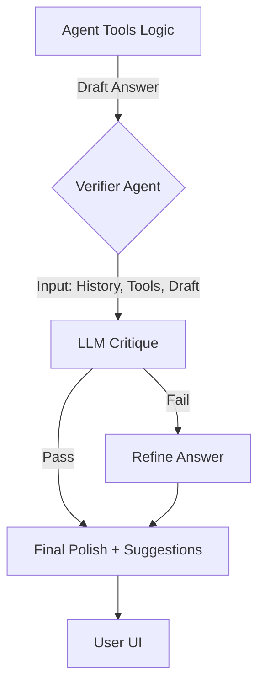

# Verification & Drive Forward Implementation Plan

## Goal
Implement a "Super-Agent" capability that verifies every response for accuracy, context coherence, and completeness before sending it to the user. Additionally, the system will proactively "Drive Forward" the conversation by suggesting relevant follow-up actions.

## Is This Crazy? (Latency Analysis)
**No, this is industry standard** for high-quality agents (often called "Reflexion" or "Critic-Corrector" patterns).
*   **Latency Cost**: Expect +1s to +2s per turn using modern fast models (e.g., GPT-4o-mini).
*   **Value**: Eliminates hallucinations (e.g., claiming to show blue pants when showing red ones) and feels much more "intelligent" by anticipating user needs.
*   **Mitigation**: We will perform Verification and Suggestion generation in a single LLM pass to minimize overhead.

## Industry Standards & Alternatives
The user asked about other implementations. Here is how our **"One-Pass Critic"** compares to academic standards:

| Pattern | Description | Pros | Cons (Why we didn't choose it) |
| :--- | :--- | :--- | :--- |
| **Reflexion** | Iterative "Try -> Fail -> Reflect -> Retry" loop. | Extremely robust. | **Too Slow**. Can take 3-4 loops (10s+) to converge. |
| **Self-RAG** | Uses special tokens (`<critic>`) trained into the model. | Fast and native. | **Requires Fine-Tuning**. We are using off-the-shelf models. |
| **CRITIC** | Verifies text by searching external tools (Google, Calc). | Grounded in truth. | Usually requires multiple separate inferences. |
| **Our Approach** | **One-Pass Critic**. | **Fast & Grounded**. Checks Truth AND Refines in 1 call. | Slightly less capable on complex math than full Reflexion. |

## Architecture

We will insert a **Verification Step** between the `Draft Answer` generation and the final response.



## Proposed Changes

### 1. New Component: `VerifierAgent`
Create `app/mcp_agents/verifier/verifier.py`.
*   **Input**:
    *   `query`: User's original text.
    *   `draft`: The answer generated by the main agent.
    *   `context`: Active filters (e.g., `price < 50`), user stats (e.g., `180cm`).
    *   `tool_outputs`: Summary of what tools returned (e.g., "Search found 0 items").
*   **Output (JSON)**:
    *   `status`: "Pass" or "Needs Fix".
    *   `critique`: Why it failed (internal monologue).
    *   `refined_answer`: Rewritten answer (if needed).
    *   `suggestions`: List of 3 brief follow-up queries (e.g., "Filter by size?", "Show me cheaper ones").

### 2. Integration: `app/routes/agent.py`
Update `agent_chat` to call `VerifierAgent` just before returning `AgentOut`.
*   Pass the "draft" answer to the verifier.
*   Update `AgentOut` to include the verified answer and the new suggestions.
*   **Error Handling**: If Verifier fails/times out, fallback to original draft.

### 3. "Drive Forward" UX
*   The `suggestions` will be exposed in the UI (frontend changes needed? Or just append to text?).
*   *Proposal*: For now, we append them as "Suggested text" buttons or simply text bullets at the bottom of the message.

## Verification Checklist (Prompt Engineering)
The Verifier will check:
1.  **Hallucination**: Does the text mention items not in the `items` list?
2.  **Constraint Adherence**: If user asked for "under $50", are the shown items actually under $50?
3.  **Tone**: Is it helpful and premium?
4.  **Tool Failure**: If search returned 0 items, did we apologize and offer alternatives instead of hallucinating?

## Step-by-Step Plan
1.  **Create Verifier Logic**: Implement `VerifierAgent` class with optimized prompt.
2.  **Integrate**: Hook into `agent.py`.
### 4. Verification Logic (The "How")
The core mechanism is **"Ground Truth vs. Claim" analysis**.

**What is "Absolute Truth"?**
In this architecture, we define **Truth** as the **Deterministic Data** returned by our backend systems (Database, Search Index, APIs).
*   **Database**: If SQL returns `count=0`, that is a hard fact.
*   **Search**: If the vector engine finds `similarity=0.2` (low), that is a hard fact.
*   **LLM (The Agent)**: The agent works in probabilities. It *might* ignore the `count=0` fact and hallucinate "Here are 5 items" because it's trained to be helpful.

**Therefore:**
The Verifier treats the **Tool Output (Code)** as the Constraint, and the **Draft Answer (Text)** as the variable that must align with the Constraint.

**The Prompt Strategy:**
We feed the Verifier LLM three inputs:
1.  **User Intent**: What the user *actually* wanted (e.g., "blue jeans").
2.  **Tool Evidence** (The Truth): The raw JSON returned by the database/search (e.g., `[{"id": 1, "color": "Red"}]`).
3.  **Draft Response** (The Claim): What the agent *plans* to say (e.g., "Here are your blue jeans").

**The Verifier's Job:**
Check for discrepancies:
*   **Hallucination Check**: Does the response claim "blue" when the evidence says "Red"?
*   **Completeness Check**: Did we ignore a filter (e.g. "under $50")?
*   **Safety Check**: Did we accidentally expose internal IDs or debug info?

**Example Scenario:**
*   *Query*: "Show me blue pants."
*   *Search Result*: Finds 0 items. Returns generic fallback (Red Pants).
*   *Draft Answer*: "I found these blue pants for you!" (Hallucination ❌)
*   *Verifier Action*: Detects color mismatch. Rejects draft.
*   *Refined Answer*: "I'm sorry, I couldn't find any blue pants right now. However, I found these popular Red Pants you might like." (Correction ✅)

### 5. The "Data Feed" (Context Assembly)
You are absolutely correct: **The Verifier needs the WHOLE picture.**

We will construct a rich context object (`VerificationContext`) that aggregates data from all layers of the application:

1.  **Session Context (Memory)**:
    *   `history`: Last 10 turns of conversation (to catch "it" references).
    *   `search_context`: Current active filters (e.g., `Type=Hoodie`, `Color=Black`).
    *   `shown_items`: IDs of products we *just* retrieved.

2.  **User Profile (Personalization)**:
    *   `traits`: User's known preferences (e.g., "Likes Oversized", "Budget < $100").
    *   `metrics`: Height/Weight data (for size verification).

3.  **Tool Provenance (The "Why")**:
    *   `tool_name`: Which tool was called (e.g., `hybrid_search`, `fit_advisor`).
    *   `tool_args`: What arguments were passed (e.g., `q="blue hoodie"`).
    *   `tool_result_summary`: A concise summary of the tool's raw output (e.g., "Found 5 items, Top 1: Black Hoodie").

**Mechanism:**
In `agent.py`, just before we finalize the response, we have all these variables in scope. We package them into a JSON structure and inject them into the system prompt of the Verifier LLM:

```json
{
  "user_profile": {"size": "L", "style": "Streetwear"},
  "active_filters": {"color": "Blue"},
  "last_tool_output": {"count": 0, "message": "No matches found"},
  "draft_response": "Here are the blue hoodies you asked for!"
}
```
*Verifier sees: "Filters=Blue, Tool=No Matches, Response=Here are blue hoodies". -> Verdict: FAIL.*
